```{r, include=FALSE}
knitr::opts_chunk$set(
  echo = TRUE, eval = TRUE
)
```


# Sobre estatística inferencial

Boa parte dos testes estatísticos usam o paradigma da testagem da hipótese nula de Neyman-Pearson. É a abordagem frequentista (também chamada de clássica ou assintótica).

O contraponto a esta abordagem foi iniciado por Cohen (1990) ao afirmar que existe algo além da significância estatística. Sua proposta é utilizar a significância prática para quantificar a intensidade dos efeitos em vez de somente suas existências.

Em oposição à abordagem assintótica está a abordagem bayesiana. Nesta, n não precisa tender para o infinito para que os testes sejam válidos. A inferência bayesiana, portanto, é adaptada ao tamanho da amostra, sem necessidade de se imaginar infinitas repetições do experimento como fazemos, por exemplo, com o bootstrapping.

# Testes estatísticos

## Para 2 grupos

### Escala Nominal


#### Teste estatístico: Qui-Quadrado (Amostras não pareadas)

O teste Qui-Quadrado é utilizado para dados em tabelas de contingência. Sendo assim, o tamanho das amostras devem ser suficientemente grandes para que se possa realizar a aproximação para a distribuição Qui-Quadrado.

O teste de homogeneidade baseado na estatística de Qui-Quadrado, verifica se determinados grupos possuem características semelhantes, segundo uma variável de interesse, tais grupos são representados por amostras extraídas de populações específicas.

Segundo [Conover, 1999], supondo que existam duas amostras aleátorias extraídas de duas populações específicas, pressupõe-se que tais amostras devem ser mutuamente independentes e considerando ainda que existam duas categorias, as observações de cada amostra podem ser classificadas em cada uma das categorias. Na tabela de contingência apresentada na Tabela 2, observa-se como pode ser feita a distribuição de frequência para ambas as amostras em cada uma das categorias.

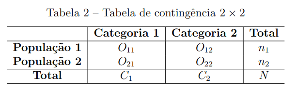

$O_{i j}$ : o número de observações que se enquadra em uma das duas categorias para cada amostra, $i, j=1,2$;
$n_{i}$ : o número de observações na $i$-ésima linha;
$C_{j}$ : o número de observações na $j$-ésima coluna;
$N$ : representa o número total de observações, isto é, $N=n_{1}+n_{2}$.
A homogeneidade das duas populações é testada por meio das seguintes hipóteses:
$$
\left\{\begin{array}{l}
H_{0}: p_{1}=p_{2} \\
H_{a}: p_{1} \neq p_{2}
\end{array}\right.
$$
Em que $p_{i}$ é a probabilidade de um indivíduo da população $i$ pertencer à Categoria
1. Consequentemente, $\left(1-p_{i}\right)$ é a probabilidade de um indivíduo da população $i$ pertencer à Categoria 2, $i=1,2$.

Para grandes amostras, a distribuição assintótica de $Q^{2}$ é dada pela aproximação da distribuição Qui-Quadrado, com 1 grau de liberdade. Sendo assim a estatística de teste

é calculada como
$$
Q^{2}=\sum_{i=1}^{2} \sum_{j=1}^{2} \frac{\left(O_{i j}-E_{i j}\right)^{2}}{E_{i j}} \approx \chi_{(1)}^{2},
$$
em que a frequência esperada $E_{i j}$ é denotada da forma
$$
E_{i j}=\frac{(\text { total da coluna } \mathrm{j}) \times(\text { total da linha } \mathrm{i})}{\text { total geral }}=\frac{n_{i} C_{j}}{N}, i, j=1,2
$$
Em casos de tabelas de contingência no formato $2 \times 2$ com frequência esperada menor que $5\left(E_{i j}<5\right)$, a aproximação para a distribuição Qui-Quadrado é considerada ruim. 

Sendo assim para estes casos, pode-se utilizar a correção de continuidade de Yates, dada por

$$
Q_{\text {Yates }}^{2}=\sum_{i=1}^{2} \sum_{j=1}^{2} \frac{\left(\left|O_{i j}-E_{i j}\right|-0,5\right)^{2}}{E_{i j}} \approx \chi_{(1)}^{2}
$$
O nível descritivo do teste (valor-p $)$ é dado por
$$
\text { valor-p }=P\left(\chi_{(1)}^{2}>Q^{2}\right)
$$

e a hipótese nula será rejeitada se valor- $p<\alpha$, sendo que $\alpha$ é o nível de significância do teste.

A razão de chances (Odds Ratio) é considerada como uma medida de associação para tabelas $2 \times 2$, representada pela Tabela 2. Sendo assim, pode-se representar $p_{1}$ como a probabilidade de sucesso da Categoria 1 , na linha 1 (Grupo 1) e $p_{2}$ como a probabilidade de sucesso da Categoria 1, na linha 2 (Grupo 2).

A razão de chances também é considerada como a razão das odds de dois grupos (linhas), sendo definida da seguinte forma:
$$
\theta=\frac{o d d s_{1}}{o d d s_{2}}=\frac{p_{1} /\left(1-p_{1}\right)}{p_{2} /\left(1-p_{2}\right)}
$$
Sendo assim, se $\left(p_{1}=p_{2}\right)$, então $\theta=1$, caracterizando que os grupos são homogêneos. Quando $(1<\theta<+\infty)$, a odds de sucesso na Categoria 1 é maior na linha 1 do que na linha 2 , e portanto $p_{1}>p_{2}$. Da mesma forma a odds de sucesso na Categoria 1 será menor na linha 1 do que na linha 2 , quando $(0<\theta<1)$, e portanto $p_{1}<p_{2}$. Na interpretação da razão de chances, dois valores para $\theta$ representarão a mesma associação, porém em direções opostas, quando um valor é o inverso do outro.


```{r eval=FALSE}
chisq.test(x,correct=T) #(com correção de continuidade)
chisq.test(x,correct=F) #(sem correção de continuidade)
```

#### Teste estatístico: Teste exato de Fisher (Amostras não pareadas, amostras de tamanho pequeno)

O Teste exato de Fisher é utilizado em situações em que existem tabelas de contingência no formato $2 \times 2$, com amostras de tamanho pequeno ( $n \leq 20$) ou algum valor esperado $e_1 \leq 1$ a literatura apresenta o teste exato de Fisher. O teste consiste em determinar a probabilidade exata de ocorrência de uma frequência observada ou de valores mais extremos. Em outras palavras, esse teste fornece valor-p exato e não exige técnica de aproximação.

Na tabela $2 \times 2$, cada observação é classificada em uma determinada célula. Para a realização do teste, supõe-se que as amostras devem ser aleatórias e independentes [Conover, 1999].


c: número total de observações na Categoria 1;

r: número total de observações na População 1;

x: Frequência observada na População 1 e Categoria 1;

$N$ : Número total de observações.

No teste exato de Fisher, os totais das linhas $(r$ e $N-r)$, e totais das colunas $(c$ e $N-c)$ são considerados fixos, sendo não aleatórios.

Considerando $p_{1}$ a probabilidade de uma observação da População 1 ser classificada na Categoria 1 e $p_{2}$, a probabilidade de uma observação da População 2 ser classificada na Categoria 1, tem-se que as hipóteses de interesse serão:

$$
\left\{\begin{array}{l}
H_{0}: p_{1}=p_{2} \\
H_{a}: p_{1} \neq p_{2}
\end{array}\right.
$$
A estatística de teste denotada por $T$, representa o número de observações na célula da primeira linha e primeira coluna. Portanto, a distribuição exata de $T$, considerando $H_{0}$ verdadeira, é dada pela distribuição hipergeométrica, isto é
$$
P(T=x)=\frac{\left(\begin{array}{l}
r \\
x
\end{array}\right)\left(\begin{array}{l}
N-r \\
c-x
\end{array}\right)}{\left(\begin{array}{l}
N \\
c
\end{array}\right)} ; x=0,1, \ldots, \min (r, c)
$$
Para amostras grandes, pode-se utilizar a aproximação para a distribuição normal padrão, dada pela seguinte expressão [Conover, 1999]:
$$
T_{o b s}=\frac{x-\frac{r c}{N}}{\sqrt{\frac{r c(N-r)(N-c)}{N^{2}(N-1)}}} \approx N(0,1)
$$
Para a decisão do teste, calcula-se o valor- $p$ utilizando a Equação (2.9), sendo as probabilidades referentes às frequências observadas e das demais situações extremas. Para o caso de teste bilateral, o nível descritivo (valor- $p$ ) do teste é definido como
$$
\text { valor- } p=2 \times \min \left\{P\left(T \leq t_{o b s}\right), P\left(T \geq t_{o b s}\right)\right\}
$$
Assim, considerando um nível de significância $\alpha$, a hipótese $H_{0}$ é rejeitada se valor- $p \leq$ $\alpha$.


```{r eval=FALSE}
fisher.test(x)
```


#### Teste estatístico: McNemar (Amostras pareadas)

O teste de McNemar consiste em detectar mudanças em planejamentos do tipo "antes e depois", em que cada unidade amostral é seu próprio controle. O teste possui o pressuposto de que as amostras devem ser pareadas (relacionadas).

Considerando duas amostras $X_{1}, \ldots, X_{n}$ e $Y_{1}, \ldots, Y_{n}$, do tipo "antes e depois", com valores pareados, pode-se construir uma tabela de contingência $2 \times 2$ para observar os desfechos.

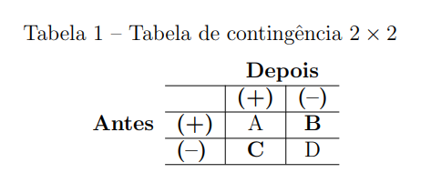

Note que $(B+C)$ representa o número total de indivíduos que acusaram alguma modificação.
As hipóteses de interesse são:

$$
\left\{\begin{array}{l}
H_{0}: p_{B}=p_{C} \\
H_{a}: p_{B} \neq p_{C}
\end{array}\right.
$$

Onde,

$p_{B}$ indica a probabilidade de uma mudança do status "(+)" para o status "(-)";

$p_{C}$ indica a probabilidade de uma mudança do status "(-)" para o status "(+)".

Sob a hipótese nula, $(B+C) / 2$ representa a frequência esperada, tanto para a casela $B$ como para a casela $C$. Portanto, o teste de McNemar consiste em fazer um teste Qui-Quadrado de aderência com os valores de $B$ e $C$. Sendo assim, a estatística de teste é dada por
$$
Q_{M c N e m a r}^{2}=\frac{(B-C)^{2}}{B+C} \approx \chi_{(1)}^{2}
$$
Quando $(B+C)<25$, a aproximação pela distribuição Qui-Quadrado pode ficar comprometida. Para estes casos, recomenda-se utilizar a correção de continuidade de Yates. Sendo assim, a estatística do teste de McNemar fica da forma
$$
Q_{M c N e m a r-c o r r i g i d o}^{2}=\frac{(|B-C|-1)^{2}}{B+C} \approx \chi_{(1)}^{2}
$$

O nível descritivo do teste (valor-p) é dado por
$$
\text { valor- } p=P\left(\chi_{(1)}^{2}>Q_{M c N e m a r}^{2}\right),
$$
e a hipótese nula será rejeitada se valor- $p<\alpha$, sendo que $\alpha$ é o nível de significância do teste.

Nota: Se a frequência esperada, $(B+C) / 2$, for menor do que 5 , deve-se utilizar o teste Binomial ao invés do teste de McNemar.


```{r eval=FALSE}
mcnemar.test(x) #(com correção de continuidade)
mcnemar.test(x,correct=F) #(sem correção de continuidade)
```

```{r echo=FALSE, eval=FALSE}
Performance <-
matrix(c(794, 86, 150, 570),
       nrow = 2,
       dimnames = list("1st Survey" = c("Approve", "Disapprove"),
                       "2nd Survey" = c("Approve", "Disapprove")))
Performance
Performance %>% sum()
mcnemar.test(Performance)
```

```{r echo=FALSE, eval=FALSE}
rbind(Performance[1,]/sum(Performance[1,]),
      Performance[2,]/sum(Performance[2,]))
```

```{r echo=FALSE, eval=FALSE}
mcnemar.test(Performance)
```


```{r echo=FALSE, eval=FALSE}
# McNemar's Test # (com correção de continuidade)
n1 = 150         # number of cases switched from + to -
n2 = 86        # number of cases switched from - to +

#program starts
chiSq = (abs(n1 - n2) - 1)^2 / (n1 + n2)  # McNemar's Chi Sq
chiSq
p = pchisq(chiSq, df=1)
p
```


```{r echo=FALSE, eval=FALSE}

# Program 2: Sample size for McNemar's test
# parameters
alpha = 0.05   # Type I Error
power = 0.8    # 1 - beta
tail = 2       # 2 tail model
p1 = n1/sum(Performance[1,])      # expected proportion that switches from + to -
p2 = n2/sum(Performance[2,])    # expected proportion that switches from - to +

# program starts
zb = qnorm(power)
za = qnorm(1 - alpha / tail)
pie = p1 + p2
theta = p1 / p2
if(theta<1) theta = 1.0 / theta
tp = theta +  1;
tm = theta - 1;
top = za*tp + zb*sqrt(tp*tp-tm*tm*pie)
top = top * top
bot = tm * tm * pie
ssiz = ceiling(top / bot);
ssiz # number of pairs

sum(Performance)
```

```{r echo=FALSE, eval=FALSE}
biostatUZH::sampleSizeMcNemar(p1, p2, alpha = 0.05, power = 0.8)
```

```{r echo=FALSE, eval=FALSE}
MESS:::power_mcnemar_test(n=NULL, paid=p1, psi=p2, power=.8)
```

```{r echo=FALSE, eval=FALSE}
# Program 3: Power estimation
# parameters
alpha = 0.05   # Type I Error
ssiz = 186    # sample size, number of pairs in data
tail = 2       # 2 tail model
p1 = 0.25      # proportion observed that switches from + to -
p2 = 0.125     # proportion observed that switches from - to +

# program starts
za = qnorm(1 - alpha / tail)
pie = p1 + p2
theta = p1 / p2
tp = theta +  1;
tm = theta - 1;
if(theta<1) theta = 1.0 / theta
top = (tm * sqrt(ssiz * pie) - za * tp);
bot = sqrt(tp * tp - tm * tm * pie);
zb = top / bot;
pw = pnorm(zb)  
pw # power (1 - beta)
```


### Escala Ordinal


#### Teste estatístico: Mann-Whitney (teste específico para duas populações independentes)

O teste de Mann - Whitney se baseia na comparação de dois grupos $(X$ e $Y)$ independentes, com a suposição de que os dados devem possuir no mínimo escala ordinal. De forma geral, o objetivo do teste é verificar se duas amostras independentes são provenientes de uma mesma população. Para a utilização do teste, observa-se uma amostra aleatória $\left(x_{1}, \ldots, x_{n}\right)$, procedente de uma população e outra amostra aleatória $\left(y_{1}, \ldots, y_{m}\right)$, procedente de uma outra população [Conover, 1999].

Com as observações dos dois grupos, verifica-se os postos dos valores sem discriminar os grupos, ou seja, ordena-se as observações e atribui-se os postos para ambos os grupos. Se a distribuição dos postos são bem próximas em ambas as amostras, existe a possibilidade de que as amostras são provenientes de uma mesma população.

Para verificar se ambas as amostras são procedentes da mesma população, as hipóteses de interesse serão:

$\left\{\begin{array}{l}H_{0}: \text { Os grupos } X \text { e } Y \text { são iguais } \\ H_{a}: \text { Os grupos } X \text { e } Y \text { são diferentes }\end{array}\right.$

Para a população $Y$, a estatística $U$ será dada da forma

$$
U_{y}=R_{y}-\frac{m(m+1)}{2},
$$

onde

$R_{y}$ representa a soma dos postos do grupo $Y$,

$m$ representa o número de observações no grupo $Y$.

Para o grupo $X$ deve ser feito o mesmo cálculo sendo representado por $U_{x}$. Quando houver poucos empates ou nenhum empate, a estatística de teste será o mínimo entre $U_{x}$ e $U_{y}$, sendo denotada da forma

$$
U_{a b s}=\min \left(U_{x}, U_{y}\right) .
$$

Portanto, ao se obter o valor crítico $d$ na tabela do teste de Mann-Whitney (Tabela 5), rejeita-se $H_{0}$ a um nível de significância específico se $U_{\text {obs }}<d$.

Para o caso de grandes amostras, utiliza-se uma aproximação para a distribuição normal padrão e portanto a estatística de teste sem correção de continuidade é dada por

$$
U=\frac{\left|U_{x}-\frac{n m}{2}\right|}{\sqrt{\frac{n m}{(n+m)(n+m-1)}\left(\frac{(n+m)^{3}-n-m}{12}-\sum_{i=1}^{l} \frac{t^{3}-t_{i}}{12}\right)}} \approx N(0,1),
$$

e a estatística com correção de continuidade é dada por

$$
U=\frac{\left|U_{x}-\frac{n m}{2}\right|-0.5}{\sqrt{\frac{n m}{(n+m)(n+m-1)}\left(\frac{(n+m)^{3}-n-m}{12}-\sum_{i=1}^{l} \frac{t^{3}-t_{i}}{12}\right)}} \approx N(0,1)
$$

em que

$n$ : número de observações na amostra aleatória referente à população $\mathrm{X}$.

$m$ : número de observações na amostra aleatória referente à população Y.

$l$ é o número de empates dos postos.

$t_{j}$ : é o número de elementos no $j$-ésimo empate (do posto).

O nível descritivo do teste (valor- $p$ ) é dado por

$$
\text { valor- } p=2 \times P(Z>|U|)
$$

Considerando um nível de significância $\alpha$, a hipótese nula é rejeitada se valor-p $p<\alpha$.

```{r eval=FALSE}
wilcox.test(x,y, correct=FALSE)
```

#### Teste estatístico: Wilcoxon (teste específico para duas populações dependentes)

Com o pressuposto de que os dados devem ter no mínimo escala ordinal, o teste de Wilcoxon pode ser utilizado para a comparação de dois grupos $(X$ e $Y$ ) pareados, para os quais pode haver medidas da mesma unidade amostral em dois tempos ou em duas situações diferentes. Sendo assim, o teste se baseia em verificar se há diferença entre os efeitos de dois tipos de tratamentos denotados pelos grupos $X$ e $Y$ [Conover, 1999].
Ao observar duas amostras $X_{1}, \ldots, X_{n}$ e $Y_{1}, \ldots, Y_{n}$ de valores pareados, calcula-se a diferença dos valores entre os grupos para as $n$ observações, e em seguida atribui-se o posto do valor absoluto para cada diferença. Se existir diferença sistemática entre as duas condições, o posto mais alto pertencerá à uma condição e o mais baixo dos postos pertencerá à outra condição [Borba, 2015]. Se ocorrer duas ou mais diferenças com o mesmo valor resultante, atribui-se o mesmo posto para todos os empates e se a diferença entre as observações dos dois grupos for nula, o posto referente a essa diferença é excluído da análise.

Para testar se o efeito dos dois grupos provenientes de duas populações $X$ e $Y$ são iguais ou diferentes, utiliza-se as hipóteses


$\left\{\begin{array}{l}H_{0}: \text { Os grupos } X \text { e } Y \text { são iguais } \\ H_{a}: \text { Os grupos } X \text { e } Y \text { são diferentes }\end{array}\right.$


Como a estatística do teste de Wilcoxon se baseia na utilização dos postos, ela será denotada para cada caso, da seguinte forma:


$1^{\circ}$ Caso - Quando não ocorrer empates entre os postos, a estatística de teste é o menor valor entre $S_{p}$ e $S_{n}$, sendo denotada da seguinte forma:

$$
W=\min \left\{S_{p}, S_{n}\right\}
$$

Aqui, $S_{p}$ é a soma dos postos das diferenças positivas e $S_{n}$ é a soma dos postos das diferenças negativas. Quanto menor o valor de $W_{\text {Wilcoxon }}$, menor é a probabilidade dos postos das diferenças terem ocorrido ao acaso. Assim, a hipótese de não existir diferenças $\left(H_{0}\right)$ é rejeitada se $W<W_{c}$, onde $W_{c}$ é o valor crítico encontrado na tabela do teste de Wilcoxon [Borba, 2015], apresentada na Tabela $4 .$

$$
\begin{aligned}
&\text { Tabela } 4 \text { - Valores Críticos }\left(W_{c}\right) \text { do teste de Wilcoxon }\\
&\begin{array}{lcccccccccc}
\hline & w_{0.005} & w_{0.01} & w_{0.025} & w_{0.05} & w_{0.1} & w_{0.2} & w_{0.3} & w_{0.4} & w_{0.5} & \frac{n(n+1)}{2} \\
\hline \mathbf{n}=\mathbf{4} & 0 & 0 & 0 & 0 & 1 & 3 & 3 & 4 & 5 & 10 \\
\mathbf{5} & 0 & 0 & 0 & 1 & 3 & 4 & 5 & 6 & 7.5 & 15 \\
\mathbf{6} & 0 & 0 & 1 & 3 & 4 & 6 & 8 & 9 & 10.5 & 21 \\
\mathbf{7} & 0 & 1 & 3 & 4 & 6 & 9 & 11 & 12 & 14 & 28 \\
\mathbf{8} & 1 & 2 & 4 & 6 & 9 & 12 & 14 & 16 & 18 & 36 \\
\mathbf{9} & 2 & 4 & 6 & 9 & 11 & 15 & 18 & 20 & 22.5 & 45 \\
\mathbf{1 0} & 4 & 6 & 9 & 11 & 15 & 19 & 22 & 25 & 27.5 & 55 \\
\mathbf{1 1} & 6 & 8 & 11 & 14 & 18 & 23 & 27 & 30 & 33 & 66 \\
\mathbf{1 2} & 8 & 10 & 14 & 18 & 22 & 28 & 32 & 36 & 39 & 78 \\
\mathbf{1 3} & 10 & 13 & 18 & 22 & 27 & 33 & 38 & 42 & 45.5 & 91 \\
\mathbf{1 4} & 13 & 16 & 22 & 26 & 32 & 39 & 44 & 48 & 52.5 & 105 \\
\mathbf{1 5} & 16 & 20 & 26 & 31 & 37 & 45 & 51 & 55 & 60 & 120 \\
\mathbf{1 6} & 20 & 24 & 30 & 36 & 43 & 51 & 58 & 63 & 68 & 136 \\
\mathbf{1 7} & 24 & 28 & 35 & 42 & 49 & 58 & 65 & 71 & 76.5 & 153 \\
\mathbf{1 8} & 28 & 33 & 41 & 48 & 56 & 66 & 73 & 80 & 85.5 & 171 \\
\mathbf{1 9} & 33 & 38 & 47 & 54 & 63 & 74 & 82 & 89 & 95 & 190 \\
\mathbf{2 0} & 38 & 44 & 53 & 61 & 70 & 83 & 91 & 98 & 105 & 210 \\
\mathbf{2 1} & 44 & 50 & 59 & 68 & 78 & 91 & 100 & 108 & 115.5 & 231 \\
\mathbf{2 2} & 49 & 56 & 67 & 76 & 87 & 100 & 110 & 119 & 126.5 & 253 \\
\mathbf{2 3} & 55 & 63 & 74 & 84 & 95 & 110 & 120 & 130 & 138 & 276 \\
\mathbf{2 4} & 62 & 70 & 82 & 92 & 105 & 120 & 131 & 141 & 150 & 300 \\
\mathbf{2 5} & 69 & 77 & 90 & 101 & 114 & 131 & 143 & 153 & 162.5 & 325 \\
\hline \text { Fonte: Conover }(1999) & & & & & & &
\end{array}
\end{aligned}
$$

$2^{\circ}$ Caso - Se ocorrer empates e se a amostra for suficiente grande, deve-se utilizar a aproximação para a distribuição normal. Sendo assim, a estatística de teste é dada da forma

$$
Z_{\text {Wilcoxon }}=\frac{\min \left(S_{p}, S_{n}\right)-\frac{m(m+1)}{4}}{\sqrt{\frac{m(m+1)(2 m+1)}{24}-\frac{\sum_{j=1}^{l}\left(t_{j}^{3}-t_{j}\right)}{48}}} \approx N(0,1),
$$

em que

$S_{p}$ : Soma dos postos das diferenças positivas

$S_{n}$ : Soma dos postos das diferenças negativas

$m$ : Número de diferenças diferentes de zero

$l$ : Número de empates (empates dos postos)

$t_{j}$ : Número de elementos no $j$-ésimo empate (dos postos).

O nível descritivo do teste (valor-p) é dado por

$$
\text { valor }-p=2 \times P\left(Z>\left|Z_{\text {Wilcoxon }}\right|\right)
$$

Considerando um nível de significância $\alpha$, a hipótese nula é rejeitada se valor- $p<\alpha$.


```{r eval=FALSE}
wilcox.test(x,y,paired=T, correct=T) #(com correção de continuidade)
wilcox.test(x,y,paired=T,correct=F) #(sem correção de continuidade)
```


#### Teste estatístico: Correlação $\tau$ de Kendall

**Correlação $\tau$ de Kendall**

A correlação $\tau$ de Kendall é utilizada para dados ordinais. Suponha que existam dois grupos de variáveis aleatórias conjuntas $X$ e $Y$, denotados por $\left(x_{1}, y_{1}\right),\left(x_{2}, y_{2}\right), \ldots,\left(x_{n}, y_{n}\right)$. Para o cálculo da correlação, deve-se obter os postos de cada variável. Após obter os postos de cada uma das variáveis, ordena-se os postos segundo uma das variáveis $(X$ ou $Y$ ). Com a ordenação dos postos da variável específica, define-se quantos pares de postos da outra variável também estão em sua ordenação natural.

A partir destes resultados, verifica-se número de pares com a ordenação correta e os pares com a ordenação errada.
Quando não houver empates, a correlação de Kendall é definida por
$$
\tau_{\text {Kendall }}=\frac{N_{C}-N_{E}}{\frac{1}{2}(n(n-1))},
$$

onde

$N_{C}$ representa o número de pares com a ordenação correta;

$N_{E}$ representa o número de pares com a ordenação errada; 

$n$ tamanho da amostra.

Note que:

- se todos os pares estiverem na ordenação correta, tem-se que $\tau_{\text {Kendall }}=1$;

- se todos os pares estiverem na ordenação errada, tem-se que $\tau_{\text {Kendall }}=-1$;

- se metade dos valores estiverem na ordenação correta e metade errada, então não há nenhuma associação entre $X$ e $Y$ e $\tau_{\text {Kendall }}=0$;

Quando houver empates, a correlação será denotada da forma

$$
\tau_{\text {Kendall }}=\frac{N_{C}-N_{E}}{\frac{1}{2} \sqrt{n(n-1)-\sum_{i=1}^{I} t_{x ; i}\left(t_{x ; i}-1\right)} \sqrt{n(n-1)-\sum_{j=1}^{J} t_{y ; j}\left(t_{y ; j}-1\right)}},
$$

em que

$t_{x ; i}$ é o número de elementos do $i$-ésimo empate da variável $X, i=1,2, \ldots, I$;

$t_{y ; j}$ é o número de elementos do $j$-ésimo empate da variável $Y, j=1,2, \ldots, J . .$

Não

**Teste da correlação $\tau$ de Kendall**

As hipóteses de interesse são:
$\left\{\begin{array}{l}H_{0}: \text { Não existe associação linear entre } X \text { e } Y \\ H_{a}: \text { Existe associação linear entre } X \text { e } Y\end{array}\right.$

A estatística de teste é denotada da forma

$$
z_{\text {Kendall }}=\frac{N_{C}-N_{E}}{\sqrt{\frac{v_{0}-v_{x}-v_{y}}{18}+\frac{v_{1}}{2 n(n-1)}+\frac{v_{2}}{9 n(n-1)(n-2)}}} \approx N(0,1),
$$

onde


$$
v_{0}=n(n-1)(2 n+5)
$$
$$
v_{x}=\sum_{i=1}^{I} t_{x ; i}\left(t_{x ; i}-1\right)\left(2 t_{x ; i}+5\right)
$$
$$
v_{y}=\sum_{j=1}^{J} t_{y ; j}\left(t_{y ; j}-1\right)\left(2 t_{y ; i}+5\right)
$$
$$
v_{1}=\left(\sum_{i=1}^{I} t_{x ; i}\left(t_{x ; i}-1\right)\right)\left(\sum_{j=1}^{J} t_{y ; j}\left(t_{y ; j}-1\right)\right)
$$
$$
v_{2}=\left(\sum_{i=1}^{I} t_{x ; i}\left(t_{x ; i}-1\right)\left(t_{x ; i}-2\right)\right)\left(\sum_{j=1}^{J} t_{y ; j}\left(t_{y ; j}-1\right)\left(t_{y ; j}-2\right)\right)
$$

Nota: Por sugestão de Kendall, se o tamanho da amostra $n \geq 8$ já existe uma boa aproximação para a distribuição normal.

Para o critério de decisão, pode-se utilizar o valor-p, que é calculado da forma

$$
\text { valor-p }=2 \times P\left[Z>\left|z_{\text {Kendall }}\right|\right] \text {. }
$$

Considerando um nível de significância $\alpha$, rejeita-se a hipótese nula $H_{0}$ se valor- $p<$ $\alpha$


```{r eval=FALSE}
cor.test(x,y,method="kendall")
```

### Escala Intervalar


#### Teste estatístico: Teste t não pareado

O teste $t$ não-pareado consiste na comparação de duas médias de duas populações específicas, averiguando se ambas as médias sāo iguais ou diferentes.

Suponha que existam duas amostras independentes $x_{1}, \ldots, x_{n 1}$ e $y_{1}, \ldots, y_{n 2}$, extraídas de duas populaçōes $X \sim N\left(\mu_{1}, \sigma_{1}^{2}\right)$ e $Y \sim N\left(\mu_{2}, \sigma_{2}^{2}\right)$, respectivamente. Para testar se existe diferença entre as médias das duas populaçōes, não importando a direçāo, as hipóteses de interesse serão da forma [Bussab \& Morettin, 2013]
$$
\left\{\begin{array}{l}
H_{0}: \mu_{1}=\mu_{2} \\
H_{a}: \mu_{1} \neq \mu_{2}
\end{array}\right.
$$
Os estimadores da média e da variância para cada amostra são calculados da forma
$$
\bar{X}=\frac{1}{n_{1}} \sum_{i=1}^{n_{1}} X_{i}
$$
$$
S_{1}^{2}=\frac{1}{n_{1}-1} \sum_{i=1}^{n_{1}}\left(X_{i}-\bar{X}\right)^{2}
$$
$$
\bar{Y}=\frac{1}{n_{2}} \sum_{i=1}^{n_{2}} Y_{i}
$$
$$
S_{2}^{2}=\frac{1}{n_{2}-1} \sum_{i=1}^{n_{2}}\left(Y_{i}-\bar{Y}^{2}\right)
$$
Este teste se adapta a dois casos específicos. Sendo assim, para cada um dos casos existe uma estatística de teste para que se possa verificar se existe diferença entre as médias das populaçōes.

Antes, deve-se realizar um teste de igualdade de variâncias para verificar se as variâncias das duas populaçōes são iguais ou não; Para realizar este teste supõe-se independência entre as duas populaçōes e as hipóteses de interesse serão:

$$
\left\{\begin{array}{l}
H_{0}: \sigma_{1}^{2}=\sigma_{2}^{2} \\
H_{a}: \sigma_{1}^{2} \neq \sigma_{2}^{2}
\end{array}\right.
$$

Visto que $S_{1}^{2}$ e $S_{2}^{2}$ são as variâncias amostrais das respectivas populações, a estatística para o teste de igualdade de variâncias é dada por
$$
W_{o b s}=\frac{S_{1}^{2}}{S_{2}^{2}},
$$
que segue uma distribuição de Fisher-Snedecor com $\left(n_{1}-1\right)$ e $\left(n_{2}-1\right)$ graus de liberdade. O nível descritivo $($ valor- $p$ ) do teste de igualdade de variâncias é dado por
$$
\text { valor- } p=2 \times \min \left\{P\left(F_{\left(n_{1}-1, n_{2}-1\right)}>W_{o b s}\right), P\left(F_{\left(n_{1}-1, n_{2}-1\right)}<W_{o b s}\right)\right\} .
$$
Considerando um nível de significância $\alpha$, a hipótese $H_{0}$ (de igualdade de variâncias) é rejeitada se valor- $p<\alpha$.

##### 1° Caso - Variâncias populacionais iguais e desconhecidas:

Suponha que o teste de igualdade de variâncias não rejeitou a hipótese de igualdade de variâncias. A estatística de teste das hipóteses
$$
\left\{\begin{array}{l}
H_{0}: \mu_{1}=\mu_{2} \\
H_{a}: \mu_{1} \neq \mu_{2}
\end{array}\right.
$$
é dada por:
$$
T=\frac{\bar{X}-\bar{Y}}{S_{p} \sqrt{1 / n_{1}+1 / n_{2}}} \sim t_{\left(n_{1}+n_{2}-2\right)},
$$
em que
$$
S_{p}^{2}=\frac{\sum_{i=1}^{n_{1}}\left(X_{i}-\bar{X}\right)^{2}+\sum_{i=1}^{n_{2}}\left(Y_{i}-\bar{Y}\right)^{2}}{n_{1}+n_{2}-2} .
$$
O nível descritivo do teste (valor- $p$ ) é dado por
$$
\text { valor- } p=2 \times P\left[T_{\left(n_{1}+n_{2}-2\right)}>\left|T_{o b s}\right|\right] \text {. }
$$
Considerando um nível de significância $\alpha$, a hipótese nula é rejeitada se valor- $p<\alpha$.

```{r eval=FALSE}
t.test(x,y,var.equal=TRUE)
```

##### 2° Caso - Variâncias populacionais desiguais e desconhecidas:

Neste caso, se ao realizar o teste de igualdade de variâncias, e a hipótese nula for rejeitada, concluí-se que as variâncias populacionais são diferentes, sendo assim, A estatística de teste das hipóteses
$$
\left\{\begin{array}{l}
H_{0}: \mu_{1}=\mu_{2} \\
H_{a}: \mu_{1} \neq \mu_{2}
\end{array}\right.
$$
é dada por
$$
\begin{gathered}
T_{o b s}=\frac{\bar{X}-\bar{Y}}{\sqrt{S_{1}^{2} / n_{1}+S_{2}^{2} / n_{2}}} \sim t_{v} \\
v=\frac{(A+B)^{2}}{A^{2} /\left(n_{1}-1\right)+B^{2} /\left(n_{2}-1\right)}
\end{gathered}
$$
na qual
$$
A=s_{1}^{2} / n_{1}
$$
e
$$
B=s_{2}^{2} / n_{2}
$$
O nível descritivo do teste (valor- $p$ ) é dado por
$$
\text { valor }-p=2 \times P\left(t_{(v)}>\left|T_{o b s}\right|\right)
$$
Considerando um nível de significância $\alpha$, a hipótese nula é rejeitada se valor- $p<\alpha$.


```{r eval=FALSE}
t.test(x,y,var.equal=FALSE)
```


#### Teste estatístico: Teste t pareado

O teste $t$ pareado consiste em verificar se as médias de duas populaçōes (População 1 e 2) dependentes são iguais.

Suponha que existam duas amostras $X_{1}, \ldots, X_{n}$ e $Y_{1}, \ldots, Y_{n}$ em que as observaçōes são dependentes (pareadas). Ao definir a variável aleátoria $D=X-Y$, obtém-se uma amostra $D_{1}, \ldots, D_{n}$ que é o resultado das diferenças entre os valores de cada par [Bussab \& Morettin, 2013]. Considerando que a variável aleatória $D$ tem distribuição normal $N\left(\mu_{D}, \sigma_{D}^{2}\right), \sigma_{D}^{2}$ desconhecido, pode-se inferir que :
$$
\bar{D}=\frac{1}{n} \sum_{i=1}^{n}\left(X_{i}-Y_{i}\right)=\bar{X}-\bar{Y} \sim N\left(\mu_{D}, \frac{\sigma_{D}^{2}}{n}\right)
$$
Como $\mu_{D}=E(D)=E(X-Y)=E(X)-E(Y)=\mu_{1}-\mu_{2}$, qualquer informação sobre $\mu_{1}-\mu_{2}$ corresponde a $\mu_{D}$. Portanto, para testar se as médias dos grupos são iguais, as hipóteses de interesse serão:
$$
\left\{\begin{array}{l}
H_{0}: \mu_{D}=0 \\
H_{a}: \mu_{D} \neq 0
\end{array}\right.
$$
Considerando que
$$
S_{D}^{2}=\frac{1}{n-1} \sum_{i=1}^{n}\left(D_{i}-\bar{D}\right)^{2}
$$
a estatística de teste é dada por
$$
T_{o b s}=\frac{\sqrt{n}\left(\bar{D}-\mu_{D}\right)}{S_{D}}
$$
e terá distribuição $t$ de Student, com $(n-1)$ graus de liberdade.
Para o critério de decisão, pode-se utilizar o valor-p, neste caso de teste bilateral, o valor- $p$ é calculado da forma
$$
\text { valor- } p=2 \times P\left(t_{(n-1)}>\left|T_{o b s}\right|\right) \text {, }
$$
tendo por base na distribuição $t$ de Student, com $(n-1)$ graus de liberdade. Considerando um nível de significância $\alpha$, rejeita-se $H_{0}$, se valor- $p<\alpha$.


```{r eval=FALSE}
t.test(x,y,paired=TRUE)
```


<!-- ## Para 3 grupos ou mais -->

# Medidas de Efeito

## Para 2 grupos

### Escala Nominal

#### Medida de efeito: Coeficiente $\phi$

O coeficiente Phi $(\phi)$ é uma medida indicada para tabelas de contingência $2 \times 2$, sendo um caso específico da medida mais generalizada $V$ de Cramér, podendo ser associada ao teste Qui-Quadrado quando os dois grupos são não-pareados ou ao teste de McNemar quando os dois grupos são pareados.

No caso de dois grupos não-pareados, após obter o valor do estatística de QuiQuadrado $Q^{2}$, o valor do coeficiente é denotado da forma [Cohen, 1988]

$$
\phi=\sqrt{\frac{Q^{2}}{n}},
$$

onde

$n$ representa o número de observações na amostra;

$Q^{2}$ é a estatística do teste Qui-Quadrado.

Quando os dois grupos são pareados, o coeficiente $\phi$ é baseado na estatística do teste de McNemar  e é definido por

$$
\phi=\sqrt{\frac{Q_{M c N e m a r}^{2}}{n}}=\sqrt{\frac{\frac{(B-C)^{2}}{B+C}}{n}}
$$

O coeficiente $\phi$ pode variar de 0 a 1 . Quanto maior é o valor de $\phi$, maior é a diferença entre os dois grupos. A Tabela 6 traz os valores para os níveis de magnitude do efeito $(E S)$ sugeridos por [Cohen, 1992] para o coeficiente $\phi$.

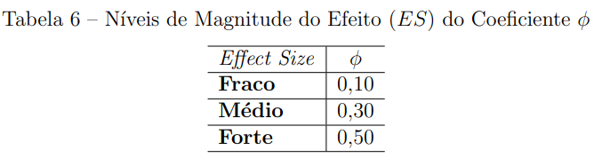

##### Associação ao teste Qui-Quadrado (Amostras não pareadas)

```{r}
data <- matrix(c(25,5,15,15),ncol=2,byrow=T)
data


```

- Verifica as frequências esperadas

```{r}
e1 <- apply(data, 2, sum)/nrow(data)
e2 <- apply(data, 2, sum)/nrow(data)
rbind(e1,e2) # Como as frequências esperadas não são menores $(E_{i j}<5)$, a correção de continuidade de Yates não foi utilizada.


chisq.test(data,correct=F)$expected # avalia freq esperadas diretamente pelo teste
```

- Teste Qui-Quadrado

```{r}
chisq.test(data,correct=F) #(sem correção de continuidade)
```

- Cálculo do coeficiente phi

```{r message=FALSE}
as.numeric(sqrt(chisq.test(data,correct=F)$statistic/sum(data))) #(sem correção de continuidade de Yates)

library(psych)
psych::phi(data,digits=7)

# ou
library(DescTools)
DescTools::CramerV(data)
```

##### Associação ao teste McNemar (Amostras pareadas)

```{r}
Performance <- matrix(c(794, 86, 150, 570),
                      nrow = 2,
                      dimnames = list("1st Survey" = c("Approve", "Disapprove"),
                                      "2nd Survey" = c("Approve", "Disapprove")))
Performance

```

- Verifica necessidade de utilizar o teste binomial

```{r}
(Performance[1,2]+Performance[2,1])/2 # < 5 # Não precisa utilizar o teste binomial
```

- Verifica necessidade de utilizar a correção de continuidade de Yates

```{r}
(Performance[1,2]+Performance[2,1]) # < 25 # Não precisa utilizar a correção de continuidade de Yates
```

- Teste McNemar

```{r}
mcnemar.test(Performance, correct = FALSE)
```

```{r echo=FALSE, eval=FALSE}
mcnemar.test(Performance, correct = TRUE)
```

- Cálculo do coeficiente phi

```{r}
# sem correção de continuidade de Yates
mcnemar.test(Performance, correct = FALSE)
phi <- as.numeric(sqrt(mcnemar.test(Performance, correct = FALSE)$statistic/sum(Performance)))
phi

```

```{r echo=FALSE, eval=FALSE}
# com correção de continuidade de Yates
mcnemar.test(data, correct = TRUE)
phi <- as.numeric(sqrt(mcnemar.test(data, correct = TRUE)$statistic/sum(data)))
phi
# mcnemar.test_statistic <- ((abs(data[1,2]-data[2,1]) - 1) ^2) / (data[1,2]+data[2,1]) 
# sqrt( mcnemar.test_statistic / sum(data) )
```


<!-- Teste Mcnemar -->


```{r echo=FALSE, eval=FALSE}
library(magrittr)
data %>% sum()
MESS::power.mcnemar.test(n = 60, paid = NULL, psi = NULL, sig.level = 0.05, power = NULL, alternative = c("two.sided", "one.sided"), method = c("normal", "exact"))
```

```{r echo=FALSE, eval=FALSE}
phi <- sqrt(mcnemar.test(data, correct = TRUE)$statistic/sum(data))
q_mcnemar <- ((abs(data[1,2]-data[2,1]) - 1) ^2) / (data[1,2]+data[2,1]) 
sqrt( q_mcnemar / sum(data) )
```

```{r echo=FALSE, eval=FALSE}
pwr.chisq.test(w=ES.w1(null,alt), N=60, df=(4-1), sig.level=0.05)
```

```{r echo=FALSE, eval=FALSE}
library(MESS)
MESS::power.mcnemar.test(n=NULL, paid=.1, psi=2, power=.8, method="normal")
```


#### Medida de efeito: W de Cohen

Cohen introduziu uma estatística denominada $W$, sendo que essa estatística fornece uma resultado do $E S$ e é associada ao teste Qui-Quadrado. A sua fórmula é semelhante à do Qui-Quadrado, no entanto utiliza proporções ao invés de frequências [Cohen, 1988].

Sua expressão é denotada da forma

$$
w=\sqrt{\sum_{i=1}^{m} \frac{\left(P_{1 i}-P_{0 i}\right)^{2}}{P_{0 i}}}
$$

em que

$m$ representa o número de caselas na tabela de contingência.

$P_{0 i}$ representa a proporção na $i$-ésima casela postulada pela hipótese nula, ou seja, as proporções esperadas que são especificadas pela hipótese nula.
$P_{1 i}$ representa a proporção na $i$-ésima casela postulada pela hipótese alternativa, ou seja, as proporções observadas nos dados.

A Tabela 7 a seguir traz os valores para os níveis de magnitude de efeito $(E S)$ sugeridos na literatura [Cohen, 1988].

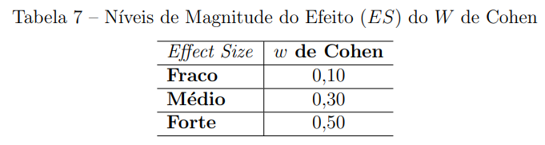


```{r}
library(rcompanion)
data <- matrix(c(25,5,15,15),ncol=2,byrow=T)
data
rcompanion::cohenW(data)
```

#### Medida de efeito: V de Cramér

O $V$ de Cramér é uma medida associada ao teste Qui-Quadrado. Se o número de colunas e linhas na tabela de contingência for igual a dois, então $V=\phi$. A indicação para o uso de $V$ como um $E S$ ocorre quando o número de linhas ou colunas na tabela de contingência for maior que dois.

A sua expressão é dada da forma [Cohen, 1988]

$$
V=\sqrt{\frac{Q^{2}}{n(k-1)}}
$$

onde

$n$ representa o número de observações na amostra;

$k$ representa o menor valor entre o número de linhas e colunas;

$Q^{2}$ é a estatística do teste Qui-Quadrado.

A Tabela 8 traz os valores para os níveis de magnitude do efeito $(E S)$ sugeridos por [Cohen, 1988].

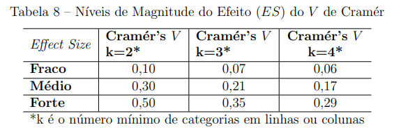

```{r}
data <- matrix(c(25,5,15,15),ncol=2,byrow=T)
data
library(rcompanion)
rcompanion::cramerV(data)
```


<!-- #### Medida de efeito: Razão de Chances -->

<!-- A razão de chances (Odds Ratio) fornece um resultado mais concreto do $E S$ do que um mero valor de Qui-Quadrado ou do valor- $p$ que lhe está associado [Conboy, 2003]. Sendo assim, a Odds Ratio é projetada para contrastar dois grupos em uma variável dependente binária (dicotômica), sendo a razão entre a chance de ocorrência do evento em um grupo e a chance de ocorrência do evento em outro grupo, podendo ser calculada através dos resultados obtidos em uma tabela de contingência $2 \times 2$, como na Tabela 9 . -->

<!-- 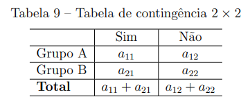 -->

<!-- Considerando os totais das colunas fixos, o cálculo da razão de chances é feito da forma -->

<!-- $$ -->
<!-- O R=\frac{a_{11} / a_{21}}{a_{12} / a_{22}} -->
<!-- $$ -->
<!-- Diferente da razão de chances, o risco relativo é uma razão entre o risco de ocorrência do evento em um grupo e o risco de ocorrência do evento em outro grupo. -->

<!-- O risco relativo estima a magnitude entre o 'desfecho', que é a variável de interesse no estudo, e a exposição ao 'fator de risco', que é uma variável que supõe-se ser associada ao desfecho, indicando quantas vezes a ocorrência do desfecho é maior do que aquela entre os não-expostos [Wagner \& Callegari-Jacques, 1998]. -->


<!--  -->

<!-- Na tabela acima, pode-se considerar o 'Grupo A' como o grupo exposto ao fator de risco e o 'Grupo B' como o grupo não-exposto ao fator de risco. Considerando os totais das linhas fixos, o cálculo do risco relativo é feito da forma -->

<!-- $$ -->
<!-- R R=\frac{a_{11} /\left(a_{11}+a_{12}\right)}{a_{21} /\left(a_{21}+a_{22}\right)} -->
<!-- $$ -->

<!-- Na tabela abaixo encontram-se os valores para interpretação dos níveis de magnitude do efeito $(E S)$ da razão de chances e do risco relativo [Sullivan \& Feinn, 2012]. -->

<!-- 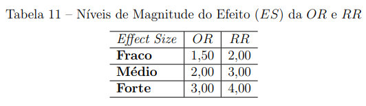 -->


<!-- ```{r} -->
<!-- library(DescTools) -->
<!-- # Exemplo para calculo da OR: -->
<!-- x11 <- 30 -->
<!-- x12 <- 20 -->
<!-- x21 <- 25 -->
<!-- x22 <- 40 -->
<!-- x <- matrix(0,2,2) -->
<!-- x[1,1] <- x11 -->
<!-- x[1,2] <- x12 -->
<!-- x[2,1] <- x21 -->
<!-- x[2,2] <- x22 -->
<!-- DescTools::OddsRatio(x) -->
<!-- ``` -->

<!-- ```{r} -->
<!-- x11 <- 30 -->
<!-- x12 <- 20 -->
<!-- x21 <- 25 -->
<!-- x22 <- 40 -->
<!-- x <- matrix(0,2,2) -->
<!-- x[1,1] <- x11 -->
<!-- x[1,2] <- x12 -->
<!-- x[2,1] <- x21 -->
<!-- x[2,2] <- x22 -->
<!-- DescTools::RelRisk(x) -->
<!-- ``` -->

#### Medida de efeito: Q de Yule

O $Q$ de Yule é uma transformação algébrica direta da razão de chances Odds Ratio, sendo que a sua variação é de $-1$ a 1 . Tal medida possui utilidade para o estudo do $E S$ [Bakeman \& Quera, 2011].

Apesar de possuir uma interpretação não tão descritiva igual à $O d d s$ Ratio, o $Q$ de Yule é menos vulnerável a uma contagem de células iguais a 0 e pode ser uma alternativa para a $O d d s$ Ratio como $E S$. Se o resultado da estatística for $Q=0$ indica-se que não há efeito entre as duas variáveis.

Considerando a Tabela 9, o cálculo do $Q$ de Yule é denotado da seguinte forma:

$$
Q=\frac{\left(a_{11} \times a_{22}\right)-\left(a_{12} \times a_{21}\right)}{\left(a_{11} \times a_{22}\right)+\left(a_{12} \times a_{21}\right)},
$$

e pode ser denotado também da seguinte forma:

$$
Q=\frac{(O R-1)}{(O R+1)},
$$

em que

$O R$ representa a Razão de Chances, expressão obtida em (3.5).

A Tabela 12 traz os valores sugeridos para os níveis de magnitude do efeito $(E S)$, sendo valores equivalentes aos níveis de magnitude do efeito do Coeficiente $Q$ de Yule [Bakeman \& Quera, 2011].

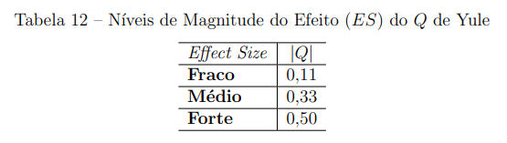

```{r}
library(DescTools)
x11 <- 30
x12 <- 20
x21 <- 25
x22 <- 40
x <- matrix(0,2,2)
x[1,1] <- x11
x[1,2] <- x12
x[2,1] <- x21
x[2,2] <- x22
DescTools::YuleQ(x)
```

### Escala Ordinal


#### Medida de efeito: Delta $\delta$ de Clif

O Delta $(\delta)$ de Cliff é uma medida não paramétrica que permite quantificar a magnitude da diferença entre dois grupos de observação que não atendem aos pressupostos de normalidade [Cardoso, Mello \& Freitas, 2013]. Portanto, o $\delta$ de Cliff é uma medida utilizada para grupos independentes, que possuem escala de mensuração ordinal e consequentemente é associado ao teste de Mann-Whitney.

Tal medida estima a probabilidade de uma observação aleatoriamente selecionada de um grupo ser maior do que uma observação aleatoriamente selecionada de outro grupo, menos a probabilidade reversa [Cliff, 1996]. Supondo dois grupos de tratamentos $x$ e $y$ procedentes de duas populações $X$ e $Y$, o cálculo da estimativa do $\delta$ de Cliff é dado da forma [Cardoso, Mello \& Freitas, 2013]

$$
\delta=\frac{\sum_{i=1}^{n} \sum_{j=1}^{m}\left(\mathbb{I}_{\left(x_{i}>y_{j}\right)}\left(x_{i}, y_{j}\right)-\mathbb{I}_{\left(x_{i}<y_{j}\right)}\left(x_{i}, y_{j}\right)\right)}{m n},
$$

em que

$$
\mathbf{I}_{\left(x_{i}>y_{j}\right)}\left(x_{i}, y_{j}\right)=\left\{\begin{array}{l}
1, \text { se } x_{i}>y_{j} \\
0, \text { Caso contrário }
\end{array}\right.
$$
$$
\mathbb{I}_{\left(x_{i}<y_{j}\right)}\left(x_{i}, y_{j}\right)=\left\{\begin{array}{l}
1, \text { se } x_{i}<y_{j} \\
0, \text { Caso contrário, }
\end{array}\right.
$$

onde

$x_{i}:$ representa a $i$-ésima observação do grupo $x$;

$y_{j}$ : representa a $j$-ésima observação do grupo $y$;

$n$ : representa o número de observações do grupo $x$;

$m$ : representa o número de observações do grupo $y$.

Em (3.9), cada observação de um grupo é comparada a cada observação no outro grupo, sendo assim, verifica-se quantas vezes as observações de um grupo são maiores ou inferiores ao número de observações do outro grupo. $\mathrm{O}$ valor de $\delta$ varia entre $-1$ e 1 . Se o seu resultado for igual a 1, então todos os valores de um grupo são superiores aos valores do outro grupo; o inverso ocorre quando o resultado for igual a $-1$.

Como o $\delta$ de Cliff é linearmente relacionado à estatística $U$ de Mann-Whitney, dada a estatística de Mann-Whitney, a expressão é denotada da forma [Cliff, 1996]

$$
\delta=\frac{2 U}{m n}-1
$$

onde

$U$ : representa o resultado da estatística de Mann-Whitney (2.16);

$n$ : representa o número de observações do grupo $x$;

$m$ : representa o número de observações do grupo $y$.

A magnitude é avaliada utilizando os limiares fornecidos em [Romano, 2006], e apresentados na Tabela 13 .

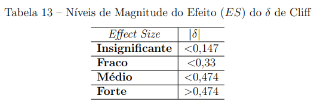


```{r}
library(effsize)
grupo1 <- c(10,10,20,20,20,30,30,30,40,50)
grupo2 <- c(10,20,30,40,40,50)
resultado <- effsize::cliff.delta(grupo1,grupo2,return.dm=T)
print(resultado)
```


```{r}
print(resultado$dm)
```

#### Medida de efeito: $A$ de Vargha-Delaney

O $A$ de Vargha-Delaney é uma transformação linear simples do $\delta$ de Cliff, sendo também associada ao teste de Mann-Whitney e utilizada para grupos independentes com escala de mensuração ordinal. Essa estatística varia de 0 a 1 , diferente do $\delta$ de Cliff que varia de $-1$ a 1 [Vargha \& Delaney, 2000].

Considerando uma amostra aleatória $\left(x_{1}, \ldots, x_{n}\right)$, procedente de uma população $X$ e outra amostra aleatória $\left(y_{1}, \ldots, y_{m}\right)$, procedente de uma outra população $Y$, a estimativa do $A$ de Vargha-Delaney é dada da forma [Vargha \& Delaney, 2000]

$$
A=\frac{\sum_{i=1}^{n} \sum_{j=1}^{m}\left(\mathbb{I}_{\left(x_{i}>y_{j}\right)}\left(x_{i}, y_{j}\right)+0.5 \times \mathbb{I}_{\left(x_{i}=y_{j}\right)}\left(x_{i}, y_{j}\right)\right)}{m n}
$$
em que
$$
\mathrm{I}_{\left(x_{i}>y_{j}\right)}\left(x_{i}, y_{j}\right)=\left\{\begin{array}{l}
1, \text { se } x_{i}>y_{j} \\
0, \text { Caso contrário }
\end{array}\right.
$$
e
$$
\mathrm{I}_{\left(x_{i}=y_{j}\right)}\left(x_{i}, y_{j}\right)=\left\{\begin{array}{l}
1, \text { se } x_{i}=y_{j} \\
0, \text { Caso contrário },
\end{array}\right.
$$
onde

$x_{i}$ : representa a $i$-ésima observação do grupo $x$;

$y_{j}$ : representa a $j$-ésima observação do grupo $y$;

$n$ : representa o número de observações do grupo $x$;

$m$ : representa o número de observações do grupo $y$.

Baseado nos postos obtidos no teste de Mann-Whitney, o cálculo da estimativa do $A$ de Vargha-Delaney em (3.11) pode ser feito da forma

$$
A=\frac{\frac{R_{x}}{n}-\frac{(n+1)}{2}}{m},
$$

onde

$R_{x}$ representa a soma dos postos do grupo $x$;

$n$ número de observações no grupo $x$;

$m$ número de observações no grupo $y$.

Como o $A$ de Vargha-Delaney é uma transformação linear do $\delta$ de Cliff, o seu valor pode ser obtido da forma

$$
A=\frac{\delta+1}{2},
$$

em que

$\delta$ representa o resultado do ES $\delta$ de Cliff (3.9).

Os níveis de magnitude do efeito $(E S)$ estão representados na Tabela 14 [Vargha \& Delaney, 2000].


```{r}
library(effsize)
grupoa <- rnorm(100,mean=10)
grupob <- rnorm(100,mean=12)
d <- (c(grupoa,grupob))
effsize::VD.A(grupoa,grupob)
```

#### Medida de efeito: Coeficiente $r$

O coeficiente $r$ é um $E S$ utilizado para grupos de tratamentos pareados, com nível de mensuração ordinal e, consequentemente, ele é associado ao teste de Wilcoxon.

Pressupondo $n$ pares de valores $\left(x_{1}, y_{1}\right),\left(x_{2}, y_{2}\right), \ldots,\left(x_{n}, y_{n}\right)$, o coeficiente $r$ que obtém o grau da diferença entre as duas variáveis $X$ e $Y$ é denotado da forma [Pallant, 2007]

$$
r=\frac{Z}{\sqrt{n_{x}+n_{y}}},
$$

onde

$Z$ é o resultado da estatística do teste de Wilcoxon, dada pela expressão em (2.13);

$n_{x}$ representa o número de observações no grupo 1 ;

$n_{y}$ representa o número de observações no grupo 2.

A Tabela 15 traz os valores para os níveis de magnitude do efeito $(E S)$ sugeridos pela literatura [Pallant, 2007].

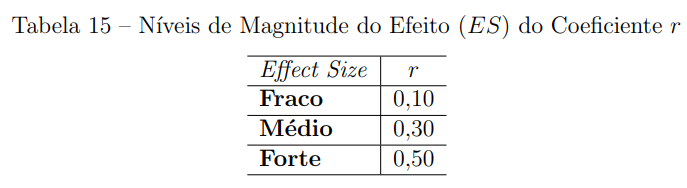

```{r}
x0 <- runif(5,min=10,max=20)
diff0 <- runif(5,min=-12,max=30)
y0 <- x0+diff0
x <- x0
y <- y0
p <- wilcox.test(x0,y0,paired=T,exact=F,correct=F)$p.value
z <- qnorm(1-(p/2))
z1 <- z/sqrt(10)
z1
```

#### Medida de efeito: $\tau$ de Kendall

O $\tau$ de Kendall é um $ES$ utilizado quando as duas variáveis possuem nível de escala ordinal. É similarmente uma medida não paramétrica que varia entre -1 e 1 [Espírito-Santo \& Daniel, 2017].

Sua fórmula é a mesma da correlação de Kendall dada pela expressão (2.20)

$$
\tau_{\text {Kendall }}=\frac{N_{C}-N_{E}}{\frac{1}{2}(n(n-1))},
$$
em que

$N_{C}$ representa o número de pares com a ordenação correta;

$N_{E}$ representa o número de pares com a ordenação errada; 

$n$ tamanho da amostra.

Os níveis de magnitude do efeito $(E S)$ estão representados na Tabela 16 [EspíritoSanto \& Daniel, 2017].

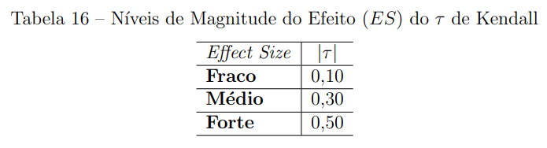


```{r}
x <- c(11,15,14,17,19,13,15,21,15,12,16,24)
y <- c(3,15,8,13,21,7,0,14,11,4,8,15)
kendall <- cor.test(x,y,method="kendall")
kendall
```


### Escala Intervalar


#### Medida de efeito: d de Cohen

Dentre os $E S$, uma medida bastante utilizada é o $d$ de Cohen. A sua utilização pode abranger grupos não-pareados ou pareados com nível de mensuração intervalar, portanto tal medida é associada ao teste $t$ não-pareado quando as duas amostras são não-pareadas e é associada ao teste $t$ pareado quando as duas amostras são pareadas.

Considerando que os dois grupos sejam independentes, a expressão para o cálculo do $d$ de Cohen é dada da forma [Lakens, 2013]

$$
d=\frac{\bar{X}-\bar{Y}}{\sqrt{\frac{(n-1) S_{1}^{2}+(m-1) S_{2}^{2}}{n+m-2}}}
$$

onde

$\bar{X}$ representa a média do grupo 1;

$\bar{Y}$ representa a média do grupo 2;

$S_{1}^{2}$ representa a variância amostral do grupo 1;

$S_{2}^{2}$ representa a variância amostral do grupo 2;

$n$ representa o número de observações no grupo 1;

$m$ representa o número de observações no grupo 2.

A fórmula do $d$ de Cohen apresenta uma diferença padronizada da média dos dois grupos no numerador e a expressão no denominador representa a estimativa do desvio padrão das amostras combinado. A medida é influenciada pelo tamanho da amostra, ou seja, o seu resultado sofrerá uma alteração resultando um valor com uma diferença não muito grande à medida que o tamanho da amostra aumenta.

Para resolver essa questão da mudança no valor do $d$ de Cohen, propusemos utilizar os estimadores de máxima verossimilhança para $\sigma_{1}^{2}$ e $\sigma_{2}^{2}$ no denominador da medida, ao invés dos estimadores não viciados $S_{1}^{2}$ e $S_{2}^{2}$.

Os estimadores de máxima verossimilhança de $\sigma_{1}^{2}$ e $\sigma_{2}^{2}$ são dados, respectivamente,

por

$$
\hat{\sigma}_{1}^{2}=\frac{1}{n} \sum_{i=1}^{n}\left(X_{i}-\bar{X}\right)^{2}
$$

$\mathrm{e}$
$$
\hat{\sigma}_{2}^{2}=\frac{1}{m} \sum_{j=1}^{m}\left(Y_{j}-\bar{Y}\right)^{2}
$$

em que

$X_{i}$ representa a $i$-ésima observação no grupo 1;

$Y_{j}$ representa a $j$-ésima observação no grupo 2;

$\bar{X}$ representa a média do grupo 1;

$\bar{Y}$ representa a média do grupo 2;

$n$ representa o número de observações no grupo 1;

$m$ representa o número de observações no grupo 2.


Considerando que as duas amostras sejam pareadas, a estimativa do $E S$ pode ser calculada diretamente do valor da estatística $T$ obtida ao realizar o teste $t$ pareado, sendo calculada da forma [Rosenthal, 1991]

$$
d=\frac{T}{\sqrt{n}},
$$

onde

$T$ é o resultado da estatística $T$, resultado obtido no teste $t$ pareado (2.26);

$n$ número de observações nas duas amostras pareadas, sendo amostras pareadas $n=m$.

Assim como o $d$ de Cohen associado ao teste $t$ não-pareado, o $d$ de Cohen associado ao teste $t$ pareado também é influenciado pelo tamanho da amostra, sendo que o seu resultado apresentará uma diferença não muito grande à medida que o tamanho da amostra aumenta.

Como no caso anterior, uma proposta para poder manter este valor invariante à medida que aumenta o tamanho da amostra é utilizar o estimador de máxima verossimilhaça $\sigma_{D}^{2}$ ao invés do estimador $S_{D}^{2}$.

O estimador de máxima verossimilhança de $\sigma_{D}^{2}$ é dado por

$$
\hat{\sigma}_{D}^{2}=\frac{1}{n} \sum_{i=1}^{n}\left(D_{i}-\bar{D}\right)^{2}
$$

Cohen definiu os níveis de magnitude do efeito $(E S)$. Tais níveis estão especificados na Tabela 17 [Cohen, 1988].

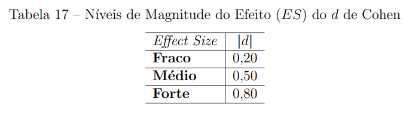


```{r}
library(effsize)
# Exemplo para d de cohen grupos independentes:
grupoa <- rnorm(100,mean=10)
grupob <- rnorm(100,mean=12)
d=(c(grupoa,grupob))
effsize::cohen.d(grupoa,grupob)
```

```{r}

# Exemplo para d de cohen grupos pareados
x0 <- rnorm(5,2,2.838)
diff0 <- rnorm(5,1,2.838)

```

```{r}
y0 <- x0+diff0
n <- 5
nx <- length(x0)
ny <- length(y0)
t <- t.test(x0,y0,paired=T)$statistic
cohen <- t/sqrt(n)
cohen
```


```{r}
effsize::cohen.d(x0,y0,paired = TRUE)
```

```{r}
cor(x0,y0)
```


#### Medida de efeito: g de Hedges

Em casos que grupos apresentam tamanhos diferentes de pequena dimensão, o $g$ de Hedges é o $E S$ mais indicado, sendo uma medida também associada ao teste $t$ não-pareado [Hedges \& Olkin, 1986].

O $g$ de Hedges é semelhante à medida $d$ de Cohen. No entanto há uma alteração em sua estimativa para corrigir o viés de pequenas amostras [Cardoso, Mello \& Freitas, 2013]. Quando o número de observações na amostra for menor que 20, o $g$ de Hedges mostra um resultado diferente do $d$ de Cohen, já se os tamanhos de amostra forem maior que 20 , os resultados de ambas as estatísticas são aproximadamente equivalentes.

Em sua fórmula há um ajustamento para pequenas amostras, sendo sua estimativa denotada da forma [Cardoso, Mello \& Freitas, 2013]:

$$
\hat{g}=\frac{\bar{X}-\bar{Y}}{\sqrt{\frac{(n-1) s_{1}^{2}+(m-1) s_{2}^{2}}{n+m-2}}}\left(1-\frac{3}{4(n-m)-9}\right)
$$

onde

$\bar{X}$ representa a média do grupo 1;

$\bar{Y}$ representa a média do grupo 2;

$S_{1}^{2}$ representa a variância amostral do grupo 1;

$S_{2}^{2}$ representa a variância amostral do grupo 2;

$n$ representa o número de observações no grupo 1;

$m$ representa o número de observações no grupo 2.

Em (3.21), mesmo com o ajuste para o cálculo do $E S$, o $g$ de Hedges, assim como o $d$ de Cohen muda o seu valor à medida que aumenta o tamanho da amostra. Para manter este resultado invariante pode-se substituir os estimadores $S_{1}^{2}$ e $S_{2}^{2}$ pelos estimadores de máxima verossimilhança $\hat{\sigma}_{1}^{2}$ e $\hat{\sigma}_{2}^{2}$.

O resultado do valor obtido pela medida $g$ de Hedges  é interpretado de forma semelhante ao valor obtido pela medida de $d$ de Cohen.

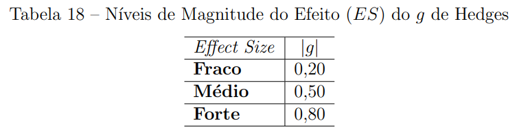

```{r}
library(effsize)
grupoa <- rnorm(100,mean=10)
grupob <- rnorm(100,mean=12)
d <- (c(grupoa,grupob))
f <- rep(c("grupoa","grupob"),each=100)
cohen.d(d,f,hedges.correction=TRUE)
```

#### Medida de efeito: Delta $\Delta$ de Glass

O Delta $(\Delta)$ de Glass é um $E S$ associado ao teste $t$ não-pareado. Sendo utilizado quando os grupos de tratamentos são independentes e quando os desvios padrão dos dois grupos são diferentes, havendo um comprometimento da homogeneidade de variâncias [Ellis, 2010].

O cálculo do $\Delta$ de Glass consiste no valor amostral da diferença da média padronizada através do desvio-padrão do grupo de controle [Lakens, 2013], supondo que o desvio padrão do grupo de controle não é afetado pelos efeitos do grupo de tratamento, refletindo mais de perto o desvio padrão populacional [Ellis, 2010]. Seu cálculo é feito por meio da expressão

$$
\Delta=\frac{\bar{X}-\bar{Y}}{S_{\text {controle }}}
$$

em que

$\bar{X}$ representa a média do grupo 1;

$\bar{Y}$ representa a média do grupo 2;

$S_{\text {controle }}$ representa o desvio padrão amostral do grupo de controle.

O resultado do valor obtido pela medida $\Delta$ de Glass é interpretado de forma semelhante ao valor obtido pela medida de $d$ de Cohen:

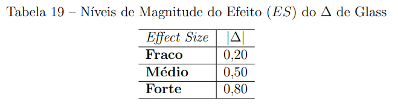

```{r}
tratamento <- rnorm(50,mean=35)
controle <- rnorm(50,mean=25)
desviotrat <- sqrt(var(tratamento))
desviocont <- sqrt(var(controle))
mediatrat <- mean(tratamento)
mediacont <- mean(controle)
delta <- ((mediatrat-mediacont)/desviocont)
delta
```

<!-- #### Medida de efeito: Psi -->

## Para 3 grupos ou mais

### Pearson ($r^2$)

$$
r=\frac{\sum_{i=1}^{n}\left(X_{i}-\bar{X}\right)\left(Y_{i}-\bar{Y}\right)}{\sqrt{\sum_{i=1}^{n}\left(X_{i}-\bar{X}\right)^{2}} \sqrt{\sum_{i=1}^{n}\left(Y_{i}-\bar{Y}\right)^{2}}}
$$
Onde:

$x_i$ e $y_i$ são os valores individuais das variáveis x e y.

$X$ é a média da variável $x$ e $Y$ é a média da variável $y$

$n$ é o número de sujeitos de cada grupo

$$
\begin{array}{|l|c|}
\hline \text { Tamanho do Efeito } & r \\
\hline \text { Pequeno } & 0.10 \\
\hline \text { Médio } & 0.30 \\
\hline \text { Grande } & 0.50 \\
\hline
\end{array}
$$


### Eta($\eta^2$)

$$
\eta^{2}=\frac{S^{2}_2}{S^{2} \text { total }}
$$

Onde:

$\boldsymbol{S}_{2}^{2}$ é a variância da intervenção, tratamento ou grupo experimental

$\boldsymbol{S}^{2}_{total}$ é a variância do grupo todo $(\mathrm{n} 1+\mathrm{n} 2)$


### Omega($\Omega^2$)

$$
\omega^{2}=\frac{\overline{x_{1}}-\overline{x_{2}}}{S_{\text {total }}^{2}}
$$

Onde:

$\mathrm{x}_{1}$ e $\mathrm{x}_{2}$ são as médias de cada grupo

$S_{\text {total }}^{2}$ é a variância total $\left(\mathrm{n}_{1}+\mathrm{n}_{2}\right)$

$\mathrm{n}_{1}$ e $\mathrm{n}_{2}$ são os números de sujeitos de cada grupo

### Cohen ($f^2$)

$$
f^{2}=\frac{\omega^{2}}{1-\omega^{2}}, \text{sendo }  \omega^{2}=\frac{\overline{x_{1}}-\overline{x_{2}}}{S_{\text {total }}^{2}}
$$
$$
\begin{array}{|l|c|}
\hline \text { Tamanho do Efeito } & f^{2} \\
\hline \text { Pequeno } & 0.02 \\
\hline \text { Médio } & 0.15 \\
\hline \text { Grande } & 0.35 \\
\hline
\end{array}
$$

# Análise de Poder

Em estudos estatísticos, muitas vezes surge a pergunta: “Quantos indivídios preciso para meu estudo?” Às vezes, a pergunta é formulada assim: “Tenho x número de pessoas disponíveis para este estudo. Vale a pena fazer o estudo?” Perguntas como essas podem ser respondidas por meio da análise de poder, um importante conjunto de técnicas em planejamento e análise de experimentos. A análise de poder busca responder essas perguntas permitindo a determinação do tamanho da amostra necessário para detectar um efeito de um determinado tamanho com um determinado grau de confiança, por exemplo.

Na análise de poder, há quatro elementos que devem ser levados em consideração: Tamanho do efeito, tamanho da amostra, nível de significância e poder do teste, conforme ilustrado na imagem abaixo:

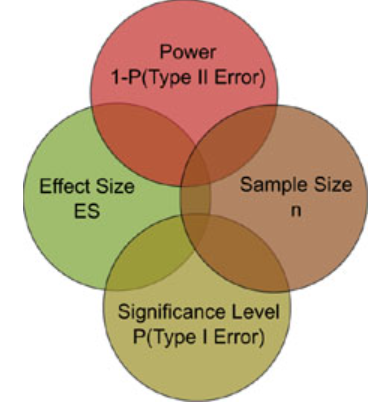

O objetivo de uma análise de poder é encontrar um equilíbrio apropriado entre esses fatores, levando em consideração os objetivos do estudo e os recursos disponíveis para o pesquisador.”

## Análise de poder - Teste t não pareado

```{r}
pwr::pwr.t.test(n = NULL, d = 0.1, sig.level = 0.05, power = 0.8, type = "two.sample", alternative = "two.sided")
pwr::pwr.t.test(n = NULL, d = 0.3, sig.level = 0.05, power = 0.8, type = "two.sample", alternative = "two.sided")
pwr::pwr.t.test(n = NULL, d = 0.5, sig.level = 0.05, power = 0.8, type = "two.sample", alternative = "two.sided")
pwr::pwr.t.test(n = NULL, d = 0.8, sig.level = 0.05, power = 0.8, type = "two.sample", alternative = "two.sided")
```
## Análise de poder - Teste t pareado

```{r}
pwr::pwr.t.test(n = NULL, d = 0.1, sig.level = 0.05, power = 0.8, type = "paired", alternative = "two.sided")
pwr::pwr.t.test(n = NULL, d = 0.3, sig.level = 0.05, power = 0.8, type = "paired", alternative = "two.sided")
pwr::pwr.t.test(n = NULL, d = 0.5, sig.level = 0.05, power = 0.8, type = "paired", alternative = "two.sided")
pwr::pwr.t.test(n = NULL, d = 0.8, sig.level = 0.05, power = 0.8, type = "paired", alternative = "two.sided")
```

Se o verdadeiro efeito for pequeno, é necessário que se tenha amostras grandes para se identificar diferenças entre os tratamentos, mantendo-se constante o nível de significância e o poder do teste.

<!-- # Simulações -->

<!-- ```{r} -->
<!-- library(DescTools) -->
<!-- library(rcompanion) -->
<!-- library(psych) -->
<!-- #phi=0.1021 -->
<!-- x11 <-1 -->
<!-- x12 <-1 -->
<!-- x21 <-5 -->
<!-- x22 <-3 -->
<!-- n <-x11+x12+x21+x22 -->
<!-- n -->
<!-- x <-matrix(0,2,2) -->
<!-- x[1,1] <-x11 -->
<!-- x[1,2] <-x12 -->
<!-- x[2,1] <-x21 -->
<!-- x[2,2] <-x22 -->
<!-- x -->
<!-- cohenW(x) -->
<!-- p <-chisq.test(x)$p.value -->
<!-- p -->
<!-- for(i in 2:100){ -->
<!-- x[1,1] <-x[1,1]+x11 -->
<!-- x[1,2] <-x[1,2]+x12 -->
<!-- x[2,1] <-x[2,1]+x21 -->
<!-- x[2,2] <-x[2,2]+x22 -->
<!-- p[i] <-chisq.test(x)$p.value -->
<!-- n[i] <-10*i -->
<!-- } -->

<!-- #x11() -->
<!-- plot(n,p,type="l",ylim=c(0,1),xlim=c(0,650),col="red") -->
<!-- cbind(n,round(p,5)) -->


<!-- ``` -->


# Referências

- Marcos Douglas Rodrigues de Sousa Principais medidas de magnitude do efeito utilizadas na comparação de dois grupos/ Marcos Douglas Rodrigues de Sousa. – Brasília, 2018-109 p. : il. (algumas color.) ; 30 cm.

- Questões de Significância (Aula dos professores Paulo S. P Silveira (silveira@usp.br) e José O. Siqueira (siqueira@usp.br))
