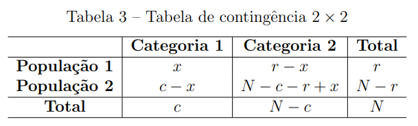
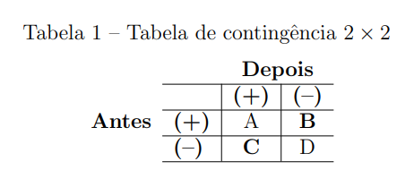
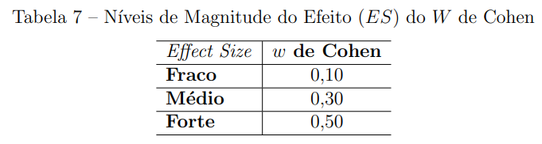
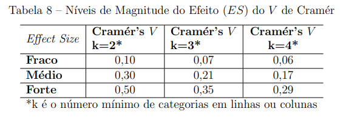
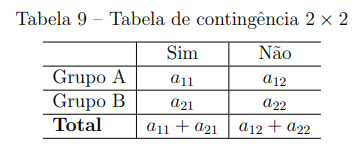
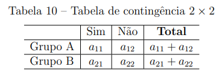
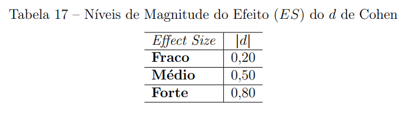
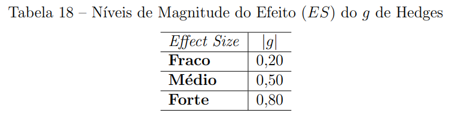
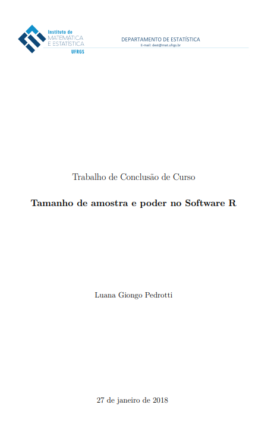

# Sobre estatística inferencial

Boa parte dos testes estatísticos usam o paradigma da testagem da hipótese nula de Neyman-Pearson. É a abordagem frequentista (também chamada de clássica ou assintótica).

O contraponto a esta abordagem foi iniciado por Cohen (1990) ao afirmar que existe algo além da **significância estatística.** Sua proposta é utilizar a **significância prática** para quantificar a intensidade dos efeitos em vez de somente suas existências.

<!-- Em oposição à abordagem assintótica está a abordagem bayesiana. Nesta, n não precisa tender para o infinito para que os testes sejam válidos. A inferência bayesiana, portanto, é adaptada ao tamanho da amostra, sem necessidade de se imaginar infinitas repetições do experimento como fazemos, por exemplo, com o bootstrapping. -->


# Análise de Poder

Em estudos estatísticos, muitas vezes surge a pergunta: “Quantos indivíduos preciso para meu estudo?” Às vezes, a pergunta é formulada assim: “Tenho x número de pessoas disponíveis para este estudo. Vale a pena fazer o estudo?” Perguntas como essas podem ser respondidas por meio da análise de poder, um importante conjunto de técnicas em planejamento e análise de experimentos. A análise de poder busca responder essas perguntas permitindo a determinação do tamanho da amostra necessário para detectar um efeito de um determinado tamanho com um determinado grau de confiança, por exemplo.

**EXEMPLO 1:** Influência das dietas A e B na glicemia

PROBLEMA: Uma nutricionista quer comparar duas diferentes dietas, A e B, no aumento da glicemia de seus pacientes. Sua hipótese é que a dieta A seja melhor que a dieta B, ou seja, o grupo alimentado com a dieta A (G1) terá menor aumento na concentração de glicose no sangue quando comparado com o grupo da dieta B (G2). No fim do experimento (que durou 6 semanas), a glicemia será medida. Ela espera que a diferença entre as médias dos dois grupos seja ao menos 10mg/dl. Assume-se que os desvios padrão serão iguais a 16 para G1 e G2.

QUESTÃO: Qual o número de pacientes necessários em cada grupo, assumindo que os dois grupos terão o mesmo tamanho?

**EXEMPLO 2:** Efeito do sexo no tempo de ação de um fármaco no organismo

PROBLEMA: Um pesquisador quer saber o efeito do sexo no tempo de ação de um determinado fármaco no organismo. Sua hipótese é que nas mulheres esse tempo seja maior que nos homens. Ele escolhe aleatoriamente 20 homens e 20 mulheres para participar do estudo.

QUESTÃO: Qual o poder do teste baseado nos 40 sujeitos para detectar diferença entre os sexos?

**DOIS ASPECTOS DO PODER DO TESTE**

PRIMEIRO: calcular o tamanho da amostra necessário para um poder de teste específico (Exemplo 1).

SEGUNDO: calcular o poder do teste quando o tamanho da amostra é dado (Exemplo 2).

**ALGUNS CONCEITOS DE ANÁLISE DE PODER**

Na análise de poder, há quatro elementos que devem ser levados em consideração: Nível de significância, poder do teste, tamanho da amostra e tamanho do efeito, conforme ilustrado na imagem abaixo:


O objetivo de uma análise de poder é encontrar um equilíbrio apropriado entre esses fatores, levando em consideração os objetivos do estudo e os recursos disponíveis para o pesquisador.”


<!-- **EXEMPLO 1:** Influência das dietas A e B na glicemia (Tamanho da amostra) -->

<!-- **INFORMAÇÕES** -->

<!-- - Espera-se diferença entre as médias, neste caso $10 \mathrm{mg} / \mathrm{dl}$. -->

<!-- - Os desvios padrão dos grupos, $\sigma_{G 1}=15$ e $\sigma_{G 2}=17$. -->

<!-- - O nível $\alpha=5 \%$, que é a probabilidade do erro Tipo I (de rejeitarmos $H_{0}$ quando ela é verdadeira), será assumido. -->

<!-- - O poder pré estabelecido para o cálculo do tamanho da amostra será $0.8$. -->

<!-- **NOTA** -->

<!-- - Neste exemplo, as médias não foram especificadas (apenas a diferença entre elas). -->

<!-- ```{r} -->
<!-- pwr::pwr.t.test(d = 10/((15 + 17)/2), power = 0.8,sig.level = 0.05, type="two.sample",alternative="two.sided") -->
<!-- ``` -->

<!-- O cálculo resulta em 42 pacientes para o G1 e 42 para G2. -->

**R packages**

- pwr
(Desenvolvido por Stéphane Champely, implementa métodos de Cohen para os testes de proporção, ANOVA unifatorial balanceada, $t$, qui-quadrado, correlação e modelo linear geral).
- pwr2
(Desenvolvido por Lu P, Liu J e Koestler D, para ANOVA unifatorial e bifatorial).
- pwr2ppl
- samplingbook
- TrialSize
- MBESS
- webpower
- asypow
- PwrGSD
- pamm
- Longpower
- powerSurvepi
- powerpkg
- powerGWASinteraction
- pedantics
- gap
- ssize.fdr


Para aprender a utilizar alguns dos pacotes citados consulte:

R in action, capítulo 10, disponível em https://livebook.manning.com/book/r-in-action/chapter-10/140

Pedrotti LG (2018) Tamanho de amostra e poder no Software R. Instituto de Matemática e Estatística. UFRGS, disponível em https://www.lume.ufrgs.br/handle/10183/175312

## Tamanho da amostra


- **População.** Toda questão de pesquisa define um universo de objetos aos
quais os resultados do estudo deverão ser aplicados.
A população alvo, também chamada população estudada, é composta
de elementos distintos possuindo um certo número de características
comuns (pelo menos).
Estes elementos, chamados de unidades populacionais, são as unidades
de análise sobre as quais serão recolhidas informações.

- **Censo:** Pesquisas utilizando todos os elementos da população.
Observação: Desvantagem quando a população é muito grande.

- **Amostra:** É qualquer subconjunto da população. Pesquisas utilizando
amostras da população, denominam-se pesquisas por amostragem

A determinação do tamanho da amostra é um problema de grande
importância, porque amostras desnecessariamente grandes acarretam
desperdício de tempo e dinheiro; e amostras demasiadamente pequenas
podem levar a resultados não confiáveis.


## Hipóteses nula e alternativa

A hipótese nula ou H0 sempre declara que não existe efeito na população. A hipótese alternativa, Ha ou H1 é a nossa previsão de como condições específicas podem estar relacionadas.

Portanto, a pergunta da pesquisa costuma estar expressa em H1, mas todo o procedimento testa apenas H0. Evidência a favor de H1, consequentemente, é obtida por exclusão. Este é o motivo pelo qual a hipótese nula é rejeitada ou a hipótese nula não é rejeitada, e não se enuncia aceitação de nenhuma das duas.


Os dois erros que podem ser cometidos ao se realizar um teste de hipóteses:

Rejeitar a hipótese H0, quando tal hipótese é verdadeira.
Não rejeitar a hipótese H0 quando ela deveria ser rejeitada.

- P(Erro Tipo I) = P(rejeitar H0|H0 é verdadeira) = $\alpha$
- P(Erro Tipo II) = P(não rejeitar H0|H0 é falsa) = $\beta$
- Poder do teste = P(Rejeitar H0|H0 é falsa) = 1 − $\beta$

O poder do teste depende de alguns fatores:

- Em geral, num experimento, a probabilidade do Erro do Tipo I é controlada ($\alpha$).
- A probabilidade do Erro do Tipo II (e consequentemente o poder do teste) não é, em geral, controlada.
- Da variabilidade da população estudada.
- Do tamanho da amostra retirada.

## Valor p

Agresti & Finlay (2012, p.171) dizem:

“O valor-p é a probabilidade de que a estatística de teste seja igual ou mais extrema que o valor observado na direção prevista pela hipótese alternativa (H1), presumindo que a hipótese nula (H0) é verdadeira.”


**P-valor sozinho é suficiente?**

É comum presumir-se que um valor p de 0,001 reflete um grande efeito, enquanto um valor p de 0,05 reflete um efeito moderado, por exemplo. Isso não é necessariamente correto pois o valor p é uma função do tamanho da amostra. Isto é, quando a amostra é muito grande, o teste tende a demonstrar diferença significativa. 

Dessa forma, é importante que se tenha mais uma medida para analisar a magnitude do efeito, que é o tamanho do efeito.


## Tamanho de efeito

Normalmente, pesquisadores e médicos se preocupam com o **tamanho do efeito**; a questão de se o efeito é nulo ou não é de interesse relativamente menor.

<!-- (Um estudo que produz um valor p de precisamente 0,05 renderá um intervalo de confiança de 95% que começa (ou termina) precisamente em 0) -->

Por exemplo, o clínico pode recomendar um medicamento, apesar de seu potencial para efeitos colaterais, se ele se sentir confortável com o fato de que aumenta a proporção de remissão em alguma quantidade específica, como 20%, 30% ou 40%.

Segundo Borenstein et al. (2008), no capítulo 2:

"O termo **tamanho do efeito** se refere à *magnitude do efeito sob a hipótese alternativa*.


Como se pode ver, a dimensão da diferença foi muito maior no estudo B do que no estudo A, apesar de ambas as diferenças serem significativas e os graus de liberdade serem os mesmos. Depois, note‐se como a dimensão da diferença foi maior no estudo C do que no D, apesar de ambas as diferenças não serem significativas. Repare-se ainda como a magnitude da diferença no estudo A foi menor do que no estudo C, apesar de a diferença ser significativa no estudo A e não ser significativa no estudo C.

Em síntese, se um investigador usar somente o nível de significância, o valor da magnitude da diferença pode perder‐se, sendo uma perda especialmente grave se a investigação disser respeito à avaliação da eficácia de um
programa de intervenção.

A natureza do tamanho do efeito irá variar de um **procedimento estatístico** para o próximo (pode ser a diferença nas proporções de cura, ou uma diferença média padronizada, ou um coeficiente de correlação), mas sua função na análise de poder é a mesma em todos os procedimentos. Por isso, é importante conhecer os diferentes testes estatísticos disponíveis para realizar a análise de poder, cálculo do tamanho da amostra e do tamanho do efeito.

# Testes estatísticos

## Para 2 grupos

### Escala Nominal


#### Teste estatístico: Qui-Quadrado (Amostras não pareadas)

O teste Qui-Quadrado é utilizado para dados em tabelas de contingência. Sendo assim, o tamanho das amostras devem ser suficientemente grandes para que se possa realizar a aproximação para a distribuição Qui-Quadrado.

O teste de homogeneidade baseado na estatística de Qui-Quadrado, verifica se determinados grupos possuem características semelhantes, segundo uma variável de interesse, tais grupos são representados por amostras extraídas de populações específicas.

Segundo [Conover, 1999], supondo que existam duas amostras aleátorias extraídas de duas populações específicas, pressupõe-se que tais amostras devem ser mutuamente independentes e considerando ainda que existam duas categorias, as observações de cada amostra podem ser classificadas em cada uma das categorias. Na tabela de contingência apresentada na Tabela 2, observa-se como pode ser feita a distribuição de frequência para ambas as amostras em cada uma das categorias.


$O_{i j}$ : o número de observações que se enquadra em uma das duas categorias para cada amostra, $i, j=1,2$;
$n_{i}$ : o número de observações na $i$-ésima linha;
$C_{j}$ : o número de observações na $j$-ésima coluna;
$N$ : representa o número total de observações, isto é, $N=n_{1}+n_{2}$.
A homogeneidade das duas populações é testada por meio das seguintes hipóteses:
$$
\left\{\begin{array}{l}
H_{0}: p_{1}=p_{2} \\
H_{a}: p_{1} \neq p_{2}
\end{array}\right.
$$
Em que $p_{i}$ é a probabilidade de um indivíduo da população $i$ pertencer à Categoria
1. Consequentemente, $\left(1-p_{i}\right)$ é a probabilidade de um indivíduo da população $i$ pertencer à Categoria 2, $i=1,2$.

Para grandes amostras, a distribuição assintótica de $Q^{2}$ é dada pela aproximação da distribuição Qui-Quadrado, com 1 grau de liberdade. Sendo assim a estatística de teste

é calculada como
$$
Q^{2}=\sum_{i=1}^{2} \sum_{j=1}^{2} \frac{\left(O_{i j}-E_{i j}\right)^{2}}{E_{i j}} \approx \chi_{(1)}^{2},
$$
em que a frequência esperada $E_{i j}$ é denotada da forma
$$
E_{i j}=\frac{(\text { total da coluna } \mathrm{j}) \times(\text { total da linha } \mathrm{i})}{\text { total geral }}=\frac{n_{i} C_{j}}{N}, i, j=1,2
$$
Em casos de tabelas de contingência no formato $2 \times 2$ com frequência esperada menor que $5\left(E_{i j}<5\right)$, a aproximação para a distribuição Qui-Quadrado é considerada ruim. 

Sendo assim para estes casos, pode-se utilizar a correção de continuidade de Yates, dada por

$$
Q_{\text {Yates }}^{2}=\sum_{i=1}^{2} \sum_{j=1}^{2} \frac{\left(\left|O_{i j}-E_{i j}\right|-0,5\right)^{2}}{E_{i j}} \approx \chi_{(1)}^{2}
$$
O nível descritivo do teste (valor-p $)$ é dado por
$$
\text { valor-p }=P\left(\chi_{(1)}^{2}>Q^{2}\right)
$$

e a hipótese nula será rejeitada se valor- $p<\alpha$, sendo que $\alpha$ é o nível de significância do teste.

<!-- A razão de chances (Odds Ratio) é considerada como uma medida de associação para tabelas $2 \times 2$, representada pela Tabela 2. Sendo assim, pode-se representar $p_{1}$ como a probabilidade de sucesso da Categoria 1 , na linha 1 (Grupo 1) e $p_{2}$ como a probabilidade de sucesso da Categoria 1, na linha 2 (Grupo 2). -->

<!-- A razão de chances também é considerada como a razão das odds de dois grupos (linhas), sendo definida da seguinte forma: -->
<!-- $$ -->
<!-- \theta=\frac{o d d s_{1}}{o d d s_{2}}=\frac{p_{1} /\left(1-p_{1}\right)}{p_{2} /\left(1-p_{2}\right)} -->
<!-- $$ -->
<!-- Sendo assim, se $\left(p_{1}=p_{2}\right)$, então $\theta=1$, caracterizando que os grupos são homogêneos. Quando $(1<\theta<+\infty)$, a odds de sucesso na Categoria 1 é maior na linha 1 do que na linha 2 , e portanto $p_{1}>p_{2}$. Da mesma forma a odds de sucesso na Categoria 1 será menor na linha 1 do que na linha 2 , quando $(0<\theta<1)$, e portanto $p_{1}<p_{2}$. Na interpretação da razão de chances, dois valores para $\theta$ representarão a mesma associação, porém em direções opostas, quando um valor é o inverso do outro. -->


```r
chisq.test(x,correct=T) #(com correção de continuidade)
chisq.test(x,correct=F) #(sem correção de continuidade)
```

#### Teste estatístico: Teste exato de Fisher (Amostras não pareadas, amostras de tamanho pequeno)

O Teste exato de Fisher é utilizado em situações em que existem tabelas de contingência no formato $2 \times 2$, com amostras de tamanho pequeno ( $n \leq 20$) ou algum valor esperado $e_1 \leq 1$ a literatura apresenta o teste exato de Fisher. O teste consiste em determinar a probabilidade exata de ocorrência de uma frequência observada ou de valores mais extremos. Em outras palavras, esse teste fornece valor-p exato e não exige técnica de aproximação.

Na tabela $2 \times 2$, cada observação é classificada em uma determinada célula. Para a realização do teste, supõe-se que as amostras devem ser aleatórias e independentes [Conover, 1999].



c: número total de observações na Categoria 1;

r: número total de observações na População 1;

x: Frequência observada na População 1 e Categoria 1;

$N$ : Número total de observações.

No teste exato de Fisher, os totais das linhas $(r$ e $N-r)$, e totais das colunas $(c$ e $N-c)$ são considerados fixos, sendo não aleatórios.

Considerando $p_{1}$ a probabilidade de uma observação da População 1 ser classificada na Categoria 1 e $p_{2}$, a probabilidade de uma observação da População 2 ser classificada na Categoria 1, tem-se que as hipóteses de interesse serão:

$$
\left\{\begin{array}{l}
H_{0}: p_{1}=p_{2} \\
H_{a}: p_{1} \neq p_{2}
\end{array}\right.
$$
A estatística de teste denotada por $T$, representa o número de observações na célula da primeira linha e primeira coluna. Portanto, a distribuição exata de $T$, considerando $H_{0}$ verdadeira, é dada pela distribuição hipergeométrica, isto é
$$
P(T=x)=\frac{\left(\begin{array}{l}
r \\
x
\end{array}\right)\left(\begin{array}{l}
N-r \\
c-x
\end{array}\right)}{\left(\begin{array}{l}
N \\
c
\end{array}\right)} ; x=0,1, \ldots, \min (r, c)
$$
Para amostras grandes, pode-se utilizar a aproximação para a distribuição normal padrão, dada pela seguinte expressão [Conover, 1999]:
$$
T_{o b s}=\frac{x-\frac{r c}{N}}{\sqrt{\frac{r c(N-r)(N-c)}{N^{2}(N-1)}}} \approx N(0,1)
$$
Para a decisão do teste, calcula-se o valor- $p$ utilizando a Equação (2.9), sendo as probabilidades referentes às frequências observadas e das demais situações extremas. Para o caso de teste bilateral, o nível descritivo (valor- $p$ ) do teste é definido como
$$
\text { valor- } p=2 \times \min \left\{P\left(T \leq t_{o b s}\right), P\left(T \geq t_{o b s}\right)\right\}
$$
Assim, considerando um nível de significância $\alpha$, a hipótese $H_{0}$ é rejeitada se valor- $p \leq$ $\alpha$.


```r
fisher.test(x)
```


#### Teste estatístico: McNemar (Amostras pareadas)

O teste de McNemar consiste em detectar mudanças em planejamentos do tipo "antes e depois", em que cada unidade amostral é seu próprio controle. O teste possui o pressuposto de que as amostras devem ser pareadas (relacionadas).

Considerando duas amostras $X_{1}, \ldots, X_{n}$ e $Y_{1}, \ldots, Y_{n}$, do tipo "antes e depois", com valores pareados, pode-se construir uma tabela de contingência $2 \times 2$ para observar os desfechos.



Note que $(B+C)$ representa o número total de indivíduos que acusaram alguma modificação.
As hipóteses de interesse são:

$$
\left\{\begin{array}{l}
H_{0}: p_{B}=p_{C} \\
H_{a}: p_{B} \neq p_{C}
\end{array}\right.
$$

Onde,

$p_{B}$ indica a probabilidade de uma mudança do status "(+)" para o status "(-)";

$p_{C}$ indica a probabilidade de uma mudança do status "(-)" para o status "(+)".

Sob a hipótese nula, $(B+C) / 2$ representa a frequência esperada, tanto para a casela $B$ como para a casela $C$. Portanto, o teste de McNemar consiste em fazer um teste Qui-Quadrado de aderência com os valores de $B$ e $C$. Sendo assim, a estatística de teste é dada por
$$
Q_{M c N e m a r}^{2}=\frac{(B-C)^{2}}{B+C} \approx \chi_{(1)}^{2}
$$
Quando $(B+C)<25$, a aproximação pela distribuição Qui-Quadrado pode ficar comprometida. Para estes casos, recomenda-se utilizar a correção de continuidade de Yates. Sendo assim, a estatística do teste de McNemar fica da forma
$$
Q_{M c N e m a r-c o r r i g i d o}^{2}=\frac{(|B-C|-1)^{2}}{B+C} \approx \chi_{(1)}^{2}
$$

O nível descritivo do teste (valor-p) é dado por
$$
\text { valor- } p=P\left(\chi_{(1)}^{2}>Q_{M c N e m a r}^{2}\right),
$$
e a hipótese nula será rejeitada se valor- $p<\alpha$, sendo que $\alpha$ é o nível de significância do teste.

Nota: Se a frequência esperada, $(B+C) / 2$, for menor do que 5 , deve-se utilizar o teste Binomial ao invés do teste de McNemar.


```r
mcnemar.test(x) #(com correção de continuidade)
mcnemar.test(x,correct=F) #(sem correção de continuidade)
```


### Escala Ordinal


#### Teste estatístico: Mann-Whitney (teste específico para duas populações independentes)

O teste de Mann - Whitney se baseia na comparação de dois grupos $(X$ e $Y)$ independentes, com a suposição de que os dados devem possuir no mínimo escala ordinal. De forma geral, o objetivo do teste é verificar se duas amostras independentes são provenientes de uma mesma população. Para a utilização do teste, observa-se uma amostra aleatória $\left(x_{1}, \ldots, x_{n}\right)$, procedente de uma população e outra amostra aleatória $\left(y_{1}, \ldots, y_{m}\right)$, procedente de uma outra população [Conover, 1999].

Com as observações dos dois grupos, verifica-se os postos dos valores sem discriminar os grupos, ou seja, ordena-se as observações e atribui-se os postos para ambos os grupos. Se a distribuição dos postos são bem próximas em ambas as amostras, existe a possibilidade de que as amostras são provenientes de uma mesma população.

Para verificar se ambas as amostras são procedentes da mesma população, as hipóteses de interesse serão:

$\left\{\begin{array}{l}H_{0}: \text { Os grupos } X \text { e } Y \text { são iguais } \\ H_{a}: \text { Os grupos } X \text { e } Y \text { são diferentes }\end{array}\right.$

Para a população $Y$, a estatística $U$ será dada da forma

$$
U_{y}=R_{y}-\frac{m(m+1)}{2},
$$

onde

$R_{y}$ representa a soma dos postos do grupo $Y$,

$m$ representa o número de observações no grupo $Y$.

Para o grupo $X$ deve ser feito o mesmo cálculo sendo representado por $U_{x}$. Quando houver poucos empates ou nenhum empate, a estatística de teste será o mínimo entre $U_{x}$ e $U_{y}$, sendo denotada da forma

$$
U_{a b s}=\min \left(U_{x}, U_{y}\right) .
$$

Portanto, ao se obter o valor crítico $d$ na tabela do teste de Mann-Whitney (Tabela 5), rejeita-se $H_{0}$ a um nível de significância específico se $U_{\text {obs }}<d$.

Para o caso de grandes amostras, utiliza-se uma aproximação para a distribuição normal padrão e portanto a estatística de teste sem correção de continuidade é dada por

$$
U=\frac{\left|U_{x}-\frac{n m}{2}\right|}{\sqrt{\frac{n m}{(n+m)(n+m-1)}\left(\frac{(n+m)^{3}-n-m}{12}-\sum_{i=1}^{l} \frac{t^{3}-t_{i}}{12}\right)}} \approx N(0,1),
$$

e a estatística com correção de continuidade é dada por

$$
U=\frac{\left|U_{x}-\frac{n m}{2}\right|-0.5}{\sqrt{\frac{n m}{(n+m)(n+m-1)}\left(\frac{(n+m)^{3}-n-m}{12}-\sum_{i=1}^{l} \frac{t^{3}-t_{i}}{12}\right)}} \approx N(0,1)
$$

em que

$n$ : número de observações na amostra aleatória referente à população $\mathrm{X}$.

$m$ : número de observações na amostra aleatória referente à população Y.

$l$ é o número de empates dos postos.

$t_{j}$ : é o número de elementos no $j$-ésimo empate (do posto).

O nível descritivo do teste (valor- $p$ ) é dado por

$$
\text { valor- } p=2 \times P(Z>|U|)
$$

Considerando um nível de significância $\alpha$, a hipótese nula é rejeitada se valor-p $p<\alpha$.


```r
wilcox.test(x,y, correct=FALSE)
```

#### Teste estatístico: Wilcoxon (teste específico para duas populações dependentes)

Com o pressuposto de que os dados devem ter no mínimo escala ordinal, o teste de Wilcoxon pode ser utilizado para a comparação de dois grupos $(X$ e $Y$ ) pareados, para os quais pode haver medidas da mesma unidade amostral em dois tempos ou em duas situações diferentes. Sendo assim, o teste se baseia em verificar se há diferença entre os efeitos de dois tipos de tratamentos denotados pelos grupos $X$ e $Y$ [Conover, 1999].
Ao observar duas amostras $X_{1}, \ldots, X_{n}$ e $Y_{1}, \ldots, Y_{n}$ de valores pareados, calcula-se a diferença dos valores entre os grupos para as $n$ observações, e em seguida atribui-se o posto do valor absoluto para cada diferença. Se existir diferença sistemática entre as duas condições, o posto mais alto pertencerá à uma condição e o mais baixo dos postos pertencerá à outra condição [Borba, 2015]. Se ocorrer duas ou mais diferenças com o mesmo valor resultante, atribui-se o mesmo posto para todos os empates e se a diferença entre as observações dos dois grupos for nula, o posto referente a essa diferença é excluído da análise.

Para testar se o efeito dos dois grupos provenientes de duas populações $X$ e $Y$ são iguais ou diferentes, utiliza-se as hipóteses


$\left\{\begin{array}{l}H_{0}: \text { Os grupos } X \text { e } Y \text { são iguais } \\ H_{a}: \text { Os grupos } X \text { e } Y \text { são diferentes }\end{array}\right.$


Como a estatística do teste de Wilcoxon se baseia na utilização dos postos, ela será denotada para cada caso, da seguinte forma:


$1^{\circ}$ Caso - Quando não ocorrer empates entre os postos, a estatística de teste é o menor valor entre $S_{p}$ e $S_{n}$, sendo denotada da seguinte forma:

$$
W=\min \left\{S_{p}, S_{n}\right\}
$$

Aqui, $S_{p}$ é a soma dos postos das diferenças positivas e $S_{n}$ é a soma dos postos das diferenças negativas. Quanto menor o valor de $W_{\text {Wilcoxon }}$, menor é a probabilidade dos postos das diferenças terem ocorrido ao acaso. Assim, a hipótese de não existir diferenças $\left(H_{0}\right)$ é rejeitada se $W<W_{c}$, onde $W_{c}$ é o valor crítico encontrado na tabela do teste de Wilcoxon [Borba, 2015], apresentada na Tabela $4 .$

$$
\begin{aligned}
&\text { Tabela } 4 \text { - Valores Críticos }\left(W_{c}\right) \text { do teste de Wilcoxon }\\
&\begin{array}{lcccccccccc}
\hline & w_{0.005} & w_{0.01} & w_{0.025} & w_{0.05} & w_{0.1} & w_{0.2} & w_{0.3} & w_{0.4} & w_{0.5} & \frac{n(n+1)}{2} \\
\hline \mathbf{n}=\mathbf{4} & 0 & 0 & 0 & 0 & 1 & 3 & 3 & 4 & 5 & 10 \\
\mathbf{5} & 0 & 0 & 0 & 1 & 3 & 4 & 5 & 6 & 7.5 & 15 \\
\mathbf{6} & 0 & 0 & 1 & 3 & 4 & 6 & 8 & 9 & 10.5 & 21 \\
\mathbf{7} & 0 & 1 & 3 & 4 & 6 & 9 & 11 & 12 & 14 & 28 \\
\mathbf{8} & 1 & 2 & 4 & 6 & 9 & 12 & 14 & 16 & 18 & 36 \\
\mathbf{9} & 2 & 4 & 6 & 9 & 11 & 15 & 18 & 20 & 22.5 & 45 \\
\mathbf{1 0} & 4 & 6 & 9 & 11 & 15 & 19 & 22 & 25 & 27.5 & 55 \\
\mathbf{1 1} & 6 & 8 & 11 & 14 & 18 & 23 & 27 & 30 & 33 & 66 \\
\mathbf{1 2} & 8 & 10 & 14 & 18 & 22 & 28 & 32 & 36 & 39 & 78 \\
\mathbf{1 3} & 10 & 13 & 18 & 22 & 27 & 33 & 38 & 42 & 45.5 & 91 \\
\mathbf{1 4} & 13 & 16 & 22 & 26 & 32 & 39 & 44 & 48 & 52.5 & 105 \\
\mathbf{1 5} & 16 & 20 & 26 & 31 & 37 & 45 & 51 & 55 & 60 & 120 \\
\mathbf{1 6} & 20 & 24 & 30 & 36 & 43 & 51 & 58 & 63 & 68 & 136 \\
\mathbf{1 7} & 24 & 28 & 35 & 42 & 49 & 58 & 65 & 71 & 76.5 & 153 \\
\mathbf{1 8} & 28 & 33 & 41 & 48 & 56 & 66 & 73 & 80 & 85.5 & 171 \\
\mathbf{1 9} & 33 & 38 & 47 & 54 & 63 & 74 & 82 & 89 & 95 & 190 \\
\mathbf{2 0} & 38 & 44 & 53 & 61 & 70 & 83 & 91 & 98 & 105 & 210 \\
\mathbf{2 1} & 44 & 50 & 59 & 68 & 78 & 91 & 100 & 108 & 115.5 & 231 \\
\mathbf{2 2} & 49 & 56 & 67 & 76 & 87 & 100 & 110 & 119 & 126.5 & 253 \\
\mathbf{2 3} & 55 & 63 & 74 & 84 & 95 & 110 & 120 & 130 & 138 & 276 \\
\mathbf{2 4} & 62 & 70 & 82 & 92 & 105 & 120 & 131 & 141 & 150 & 300 \\
\mathbf{2 5} & 69 & 77 & 90 & 101 & 114 & 131 & 143 & 153 & 162.5 & 325 \\
\hline \text { Fonte: Conover }(1999) & & & & & & &
\end{array}
\end{aligned}
$$

$2^{\circ}$ Caso - Se ocorrer empates e se a amostra for suficiente grande, deve-se utilizar a aproximação para a distribuição normal. Sendo assim, a estatística de teste é dada da forma

$$
Z_{\text {Wilcoxon }}=\frac{\min \left(S_{p}, S_{n}\right)-\frac{m(m+1)}{4}}{\sqrt{\frac{m(m+1)(2 m+1)}{24}-\frac{\sum_{j=1}^{l}\left(t_{j}^{3}-t_{j}\right)}{48}}} \approx N(0,1),
$$

em que

$S_{p}$ : Soma dos postos das diferenças positivas

$S_{n}$ : Soma dos postos das diferenças negativas

$m$ : Número de diferenças diferentes de zero

$l$ : Número de empates (empates dos postos)

$t_{j}$ : Número de elementos no $j$-ésimo empate (dos postos).

O nível descritivo do teste (valor-p) é dado por

$$
\text { valor }-p=2 \times P\left(Z>\left|Z_{\text {Wilcoxon }}\right|\right)
$$

Considerando um nível de significância $\alpha$, a hipótese nula é rejeitada se valor- $p<\alpha$.


```r
wilcox.test(x,y,paired=T, correct=T) #(com correção de continuidade)
wilcox.test(x,y,paired=T,correct=F) #(sem correção de continuidade)
```


#### Teste estatístico: Correlação $\tau$ de Kendall

**Correlação $\tau$ de Kendall**

A correlação $\tau$ de Kendall é utilizada para dados ordinais. Suponha que existam dois grupos de variáveis aleatórias conjuntas $X$ e $Y$, denotados por $\left(x_{1}, y_{1}\right),\left(x_{2}, y_{2}\right), \ldots,\left(x_{n}, y_{n}\right)$. Para o cálculo da correlação, deve-se obter os postos de cada variável. Após obter os postos de cada uma das variáveis, ordena-se os postos segundo uma das variáveis $(X$ ou $Y$ ). Com a ordenação dos postos da variável específica, define-se quantos pares de postos da outra variável também estão em sua ordenação natural.

A partir destes resultados, verifica-se número de pares com a ordenação correta e os pares com a ordenação errada.
Quando não houver empates, a correlação de Kendall é definida por
$$
\tau_{\text {Kendall }}=\frac{N_{C}-N_{E}}{\frac{1}{2}(n(n-1))},
$$

onde

$N_{C}$ representa o número de pares com a ordenação correta;

$N_{E}$ representa o número de pares com a ordenação errada; 

$n$ tamanho da amostra.

Note que:

- se todos os pares estiverem na ordenação correta, tem-se que $\tau_{\text {Kendall }}=1$;

- se todos os pares estiverem na ordenação errada, tem-se que $\tau_{\text {Kendall }}=-1$;

- se metade dos valores estiverem na ordenação correta e metade errada, então não há nenhuma associação entre $X$ e $Y$ e $\tau_{\text {Kendall }}=0$;

Quando houver empates, a correlação será denotada da forma

$$
\tau_{\text {Kendall }}=\frac{N_{C}-N_{E}}{\frac{1}{2} \sqrt{n(n-1)-\sum_{i=1}^{I} t_{x ; i}\left(t_{x ; i}-1\right)} \sqrt{n(n-1)-\sum_{j=1}^{J} t_{y ; j}\left(t_{y ; j}-1\right)}},
$$

em que

$t_{x ; i}$ é o número de elementos do $i$-ésimo empate da variável $X, i=1,2, \ldots, I$;

$t_{y ; j}$ é o número de elementos do $j$-ésimo empate da variável $Y, j=1,2, \ldots, J . .$

Não

**Teste da correlação $\tau$ de Kendall**

As hipóteses de interesse são:
$\left\{\begin{array}{l}H_{0}: \text { Não existe associação linear entre } X \text { e } Y \\ H_{a}: \text { Existe associação linear entre } X \text { e } Y\end{array}\right.$

A estatística de teste é denotada da forma

$$
z_{\text {Kendall }}=\frac{N_{C}-N_{E}}{\sqrt{\frac{v_{0}-v_{x}-v_{y}}{18}+\frac{v_{1}}{2 n(n-1)}+\frac{v_{2}}{9 n(n-1)(n-2)}}} \approx N(0,1),
$$

onde


$$
v_{0}=n(n-1)(2 n+5)
$$
$$
v_{x}=\sum_{i=1}^{I} t_{x ; i}\left(t_{x ; i}-1\right)\left(2 t_{x ; i}+5\right)
$$
$$
v_{y}=\sum_{j=1}^{J} t_{y ; j}\left(t_{y ; j}-1\right)\left(2 t_{y ; i}+5\right)
$$
$$
v_{1}=\left(\sum_{i=1}^{I} t_{x ; i}\left(t_{x ; i}-1\right)\right)\left(\sum_{j=1}^{J} t_{y ; j}\left(t_{y ; j}-1\right)\right)
$$
$$
v_{2}=\left(\sum_{i=1}^{I} t_{x ; i}\left(t_{x ; i}-1\right)\left(t_{x ; i}-2\right)\right)\left(\sum_{j=1}^{J} t_{y ; j}\left(t_{y ; j}-1\right)\left(t_{y ; j}-2\right)\right)
$$

Nota: Por sugestão de Kendall, se o tamanho da amostra $n \geq 8$ já existe uma boa aproximação para a distribuição normal.

Para o critério de decisão, pode-se utilizar o valor-p, que é calculado da forma

$$
\text { valor-p }=2 \times P\left[Z>\left|z_{\text {Kendall }}\right|\right] \text {. }
$$

Considerando um nível de significância $\alpha$, rejeita-se a hipótese nula $H_{0}$ se valor- $p<$ $\alpha$


```r
cor.test(x,y,method="kendall")
```

### Escala Intervalar


#### Teste estatístico: Teste t não pareado

O teste $t$ não-pareado consiste na comparação de duas médias de duas populações específicas, averiguando se ambas as médias sāo iguais ou diferentes.

Suponha que existam duas amostras independentes $x_{1}, \ldots, x_{n 1}$ e $y_{1}, \ldots, y_{n 2}$, extraídas de duas populaçōes $X \sim N\left(\mu_{1}, \sigma_{1}^{2}\right)$ e $Y \sim N\left(\mu_{2}, \sigma_{2}^{2}\right)$, respectivamente. Para testar se existe diferença entre as médias das duas populaçōes, não importando a direçāo, as hipóteses de interesse serão da forma [Bussab \& Morettin, 2013]
$$
\left\{\begin{array}{l}
H_{0}: \mu_{1}=\mu_{2} \\
H_{a}: \mu_{1} \neq \mu_{2}
\end{array}\right.
$$
Os estimadores da média e da variância para cada amostra são calculados da forma
$$
\bar{X}=\frac{1}{n_{1}} \sum_{i=1}^{n_{1}} X_{i}
$$
$$
S_{1}^{2}=\frac{1}{n_{1}-1} \sum_{i=1}^{n_{1}}\left(X_{i}-\bar{X}\right)^{2}
$$
$$
\bar{Y}=\frac{1}{n_{2}} \sum_{i=1}^{n_{2}} Y_{i}
$$
$$
S_{2}^{2}=\frac{1}{n_{2}-1} \sum_{i=1}^{n_{2}}\left(Y_{i}-\bar{Y}^{2}\right)
$$
Este teste se adapta a dois casos específicos. Sendo assim, para cada um dos casos existe uma estatística de teste para que se possa verificar se existe diferença entre as médias das populaçōes.

Antes, deve-se realizar um teste de igualdade de variâncias para verificar se as variâncias das duas populaçōes são iguais ou não; Para realizar este teste supõe-se independência entre as duas populaçōes e as hipóteses de interesse serão:

$$
\left\{\begin{array}{l}
H_{0}: \sigma_{1}^{2}=\sigma_{2}^{2} \\
H_{a}: \sigma_{1}^{2} \neq \sigma_{2}^{2}
\end{array}\right.
$$

Visto que $S_{1}^{2}$ e $S_{2}^{2}$ são as variâncias amostrais das respectivas populações, a estatística para o teste de igualdade de variâncias é dada por
$$
W_{o b s}=\frac{S_{1}^{2}}{S_{2}^{2}},
$$
que segue uma distribuição de Fisher-Snedecor com $\left(n_{1}-1\right)$ e $\left(n_{2}-1\right)$ graus de liberdade. O nível descritivo $($ valor- $p$ ) do teste de igualdade de variâncias é dado por
$$
\text { valor- } p=2 \times \min \left\{P\left(F_{\left(n_{1}-1, n_{2}-1\right)}>W_{o b s}\right), P\left(F_{\left(n_{1}-1, n_{2}-1\right)}<W_{o b s}\right)\right\} .
$$
Considerando um nível de significância $\alpha$, a hipótese $H_{0}$ (de igualdade de variâncias) é rejeitada se valor- $p<\alpha$.

##### 1° Caso - Variâncias populacionais iguais e desconhecidas:

Suponha que o teste de igualdade de variâncias não rejeitou a hipótese de igualdade de variâncias. A estatística de teste das hipóteses
$$
\left\{\begin{array}{l}
H_{0}: \mu_{1}=\mu_{2} \\
H_{a}: \mu_{1} \neq \mu_{2}
\end{array}\right.
$$
é dada por:
$$
T=\frac{\bar{X}-\bar{Y}}{S_{p} \sqrt{1 / n_{1}+1 / n_{2}}} \sim t_{\left(n_{1}+n_{2}-2\right)},
$$
em que
$$
S_{p}^{2}=\frac{\sum_{i=1}^{n_{1}}\left(X_{i}-\bar{X}\right)^{2}+\sum_{i=1}^{n_{2}}\left(Y_{i}-\bar{Y}\right)^{2}}{n_{1}+n_{2}-2} .
$$
O nível descritivo do teste (valor- $p$ ) é dado por
$$
\text { valor- } p=2 \times P\left[T_{\left(n_{1}+n_{2}-2\right)}>\left|T_{o b s}\right|\right] \text {. }
$$
Considerando um nível de significância $\alpha$, a hipótese nula é rejeitada se valor- $p<\alpha$.


```r
t.test(x,y,var.equal=TRUE)
```

##### 2° Caso - Variâncias populacionais desiguais e desconhecidas:

Neste caso, se ao realizar o teste de igualdade de variâncias, e a hipótese nula for rejeitada, concluí-se que as variâncias populacionais são diferentes, sendo assim, A estatística de teste das hipóteses
$$
\left\{\begin{array}{l}
H_{0}: \mu_{1}=\mu_{2} \\
H_{a}: \mu_{1} \neq \mu_{2}
\end{array}\right.
$$
é dada por
$$
\begin{gathered}
T_{o b s}=\frac{\bar{X}-\bar{Y}}{\sqrt{S_{1}^{2} / n_{1}+S_{2}^{2} / n_{2}}} \sim t_{v} \\
v=\frac{(A+B)^{2}}{A^{2} /\left(n_{1}-1\right)+B^{2} /\left(n_{2}-1\right)}
\end{gathered}
$$
na qual
$$
A=s_{1}^{2} / n_{1}
$$
e
$$
B=s_{2}^{2} / n_{2}
$$
O nível descritivo do teste (valor- $p$ ) é dado por
$$
\text { valor }-p=2 \times P\left(t_{(v)}>\left|T_{o b s}\right|\right)
$$
Considerando um nível de significância $\alpha$, a hipótese nula é rejeitada se valor- $p<\alpha$.


```r
t.test(x,y,var.equal=FALSE)
```


#### Teste estatístico: Teste t pareado

O teste $t$ pareado consiste em verificar se as médias de duas populaçōes (População 1 e 2) dependentes são iguais.

Suponha que existam duas amostras $X_{1}, \ldots, X_{n}$ e $Y_{1}, \ldots, Y_{n}$ em que as observaçōes são dependentes (pareadas). Ao definir a variável aleátoria $D=X-Y$, obtém-se uma amostra $D_{1}, \ldots, D_{n}$ que é o resultado das diferenças entre os valores de cada par [Bussab \& Morettin, 2013]. Considerando que a variável aleatória $D$ tem distribuição normal $N\left(\mu_{D}, \sigma_{D}^{2}\right), \sigma_{D}^{2}$ desconhecido, pode-se inferir que :
$$
\bar{D}=\frac{1}{n} \sum_{i=1}^{n}\left(X_{i}-Y_{i}\right)=\bar{X}-\bar{Y} \sim N\left(\mu_{D}, \frac{\sigma_{D}^{2}}{n}\right)
$$
Como $\mu_{D}=E(D)=E(X-Y)=E(X)-E(Y)=\mu_{1}-\mu_{2}$, qualquer informação sobre $\mu_{1}-\mu_{2}$ corresponde a $\mu_{D}$. Portanto, para testar se as médias dos grupos são iguais, as hipóteses de interesse serão:
$$
\left\{\begin{array}{l}
H_{0}: \mu_{D}=0 \\
H_{a}: \mu_{D} \neq 0
\end{array}\right.
$$
Considerando que
$$
S_{D}^{2}=\frac{1}{n-1} \sum_{i=1}^{n}\left(D_{i}-\bar{D}\right)^{2}
$$
a estatística de teste é dada por
$$
T_{o b s}=\frac{\sqrt{n}\left(\bar{D}-\mu_{D}\right)}{S_{D}}
$$
e terá distribuição $t$ de Student, com $(n-1)$ graus de liberdade.
Para o critério de decisão, pode-se utilizar o valor-p, neste caso de teste bilateral, o valor- $p$ é calculado da forma
$$
\text { valor- } p=2 \times P\left(t_{(n-1)}>\left|T_{o b s}\right|\right) \text {, }
$$
tendo por base na distribuição $t$ de Student, com $(n-1)$ graus de liberdade. Considerando um nível de significância $\alpha$, rejeita-se $H_{0}$, se valor- $p<\alpha$.


```r
t.test(x,y,paired=TRUE)
```


## Para 3 grupos ou mais

### Teste estatístico: ANOVA

Suponha que existam m populações para as quais queremos testar a hipótese nula de que não há diferença entre suas médias, ou seja,
$\mathrm{H}_{0}:$ "As médias populacionais são todas iguais" (i.e., $\mathrm{H}_{0}: \mu_{1}=\mu_{2}=\ldots .=\mu_{\mathrm{m}}$ )
versus
$\mathrm{H}_{1}$ : "Pelo menos uma das médias é diferente das demais"
Por exemplo, considerando cinco empresas de grande porte ligadas a diferentes atividades econômicas, desejamos testar se em média os salários pagos por essas empresas são iguais, independente do setor. Ou seja, $\mathrm{H}_{0}: \mu_{1}=\mu_{2}=\mu_{3}=\mu_{4}=\mu_{5}$ versus $\mathrm{H}_{1}: \mu_{\mathrm{i}} \neq \mu_{\mathrm{j}}$, para pelo menos um par de atividades (i; $\mathrm{j}$ ), com (i $\neq j$ ). Neste caso a variável resposta, ou seja, aquela cujas médias queremos comparar, é o salário. Já o fator, ou seja, o que influi sobre o salário, é a atividade da empresa.
Seja Y a nossa variável de interesse.
$\mathrm{Y}_{\mathrm{ij}}$ ó valor de $\mathrm{Y}$ para a j-ésima unidade amostral da i-ésima amostra, onde:
$$
j=1,2, \ldots, n_{i} \text {, para todo } i=1,2, \ldots m \text {. }
$$
Como já vimos, a Análise de Variância da variável aleatória $Y$ consiste em expressar a variação total de $\mathrm{Y}$ correspondente a esses $\mathrm{N}=\sum_{\mathrm{i}=1}^{\mathrm{m}} \mathrm{n}_{\mathrm{i}}$ dados como
"variação entre" + "variação dentro".

Em símbolos, temos $\mathrm{SS}_{\text {total }}=\mathrm{SS}_{\text {entre }}+\mathrm{SS}_{\text {dentro }}$, onde:
$\mathrm{SS}_{\text {total }}$ representa a variabilidade total dos dados
$\mathrm{SS}_{\text {entre }}$ representa a variabilidade entre as amostras
$\mathrm{SS}_{\text {dentro }}$ representa a variabilidade dentro das amostras
Sejam:
$$
\begin{aligned}
&\bar{Y}_{\mathrm{i}}=\frac{\sum_{\mathrm{j}=1}^{\mathrm{n}_{\mathrm{i}}} \mathrm{Y}_{\mathrm{ij}}}{\mathrm{n}_{\mathrm{i}}} \text { a média da amostra i, para todo } \mathrm{i}=1,2, \ldots, \mathrm{m} \\
&\overline{\mathrm{Y}}=\frac{\sum_{\mathrm{i}=1}^{\mathrm{m}} \sum_{\mathrm{j}=1}^{\mathrm{n}_{\mathrm{i}}} \mathrm{Y}_{\mathrm{ij}}}{\sum_{\mathrm{i}=1}^{\mathrm{m}} \mathrm{n}_{\mathrm{i}}} \text { a média amostral global, ou seja, a média de todas as observações }
\end{aligned}
$$
Matematicamente, temos então três somas de quadrados:
Soma dos quadrados das diferenças entre cada observação e a média global:
$$
\mathrm{SS}_{\text {total }}=\sum_{\mathrm{i}=1}^{\mathrm{m}} \sum_{\mathrm{j}=1}^{\mathrm{n}_{\mathrm{i}}}\left(\mathrm{Y}_{\mathrm{ij}}-\overline{\mathrm{Y}}\right)^{2}
$$
Soma dos quadrados das diferenças entre a média de cada grupo e a média global, ponderados pelos tamanhos de amostra:
$$
S S_{\text {entre }}=\sum_{i=1}^{m} n_{i}\left(\bar{Y}_{i}-\bar{Y}\right)^{2}
$$


Soma dos quadrados das diferenças entre cada observação e a média da amostra à qual pertence:
$$
\mathrm{SS}_{\text {dentro }}=\sum_{\mathrm{i}=1}^{\mathrm{m}} \sum_{\mathrm{j}=1}^{\mathrm{n}_{\mathrm{i}}}\left(\mathrm{Y}_{\mathrm{ij}}-\overline{\mathrm{Y}}_{\mathrm{i}}\right)^{2}=\sum_{\mathrm{i}=1}^{\mathrm{m}}\left(\mathrm{n}_{\mathrm{i}}-1\right) \mathrm{S}_{\mathrm{i}}^{2}
$$
A estatística de teste é $\mathrm{F}=\frac{\mathrm{SS}_{\text {entre }} /(\mathrm{m}-1)}{\mathrm{SS}_{\text {dentro }} /(\mathrm{N}-\mathrm{m})}$, e é possível provar que, se $\mathrm{H}_{0}$ é verdadeira, ela segue uma distribuição $\mathrm{F}$ com graus de liberdade $(\mathrm{m}-1)$ no numerador e $(\mathrm{N}-\mathrm{m})$ no denominador.

É usual organizarmos essas estatísticas em uma tabela denominada Tabela de Análise de Variância (ANOVA):
Tabela de Análise de Variância (ANOVA)


Uma vez fixado o nível de significância $\alpha$ do teste, $\mathrm{H}_{0}$ deve ser rejeitada se
$$
\mathrm{F}_{\mathrm{obs}}>\mathrm{F}_{1-\alpha},
$$
sendo que $\mathrm{F}_{1-\alpha}$ representa o quantil $1-\alpha$ da distribuição $F$ com graus de liberdade $m-1$ no numerador e $\mathrm{N}$ - $\mathrm{m}$ no denominador.
Caso contrário, $\mathrm{H}_{0}$ deve ser aceita.


# Medidas de Efeito

As medidas de efeito podem ser divididas em duas famílias:

A família d (consistindo em diferenças médias padronizadas) e a família r (medidas de força de associação).

Também podem ser divididas pelo número de grupos e nível de mensuração da variável resposta.

## Para 2 grupos

### Escala Nominal

#### Medida de efeito: Coeficiente $\phi$

O coeficiente Phi $(\phi)$ é uma medida indicada para tabelas de contingência $2 \times 2$, sendo um caso específico da medida mais generalizada $V$ de Cramér, podendo ser associada ao teste Qui-Quadrado quando os dois grupos são não-pareados ou ao teste de McNemar quando os dois grupos são pareados.

No caso de dois grupos não-pareados, após obter o valor do estatística de QuiQuadrado $Q^{2}$, o valor do coeficiente é denotado da forma [Cohen, 1988]

$$
\phi=\sqrt{\frac{Q^{2}}{n}},
$$

onde

$n$ representa o número de observações na amostra;

$Q^{2}$ é a estatística do teste Qui-Quadrado.

Quando os dois grupos são pareados, o coeficiente $\phi$ é baseado na estatística do teste de McNemar  e é definido por

$$
\phi=\sqrt{\frac{Q_{M c N e m a r}^{2}}{n}}=\sqrt{\frac{\frac{(B-C)^{2}}{B+C}}{n}}
$$

O coeficiente $\phi$ pode variar de 0 a 1 . Quanto maior é o valor de $\phi$, maior é a diferença entre os dois grupos. A Tabela 6 traz os valores para os níveis de magnitude do efeito $(E S)$ sugeridos por [Cohen, 1992] para o coeficiente $\phi$.


##### Associação ao teste Qui-Quadrado (Amostras não pareadas)


```r
data <- matrix(c(25,5,15,15),ncol=2,byrow=T)
data
```

```
##      [,1] [,2]
## [1,]   25    5
## [2,]   15   15
```

- Verifica as frequências esperadas


```r
e1 <- apply(data, 2, sum)/nrow(data)
e2 <- apply(data, 2, sum)/nrow(data)
rbind(e1,e2) # Como as frequências esperadas não são menores $(E_{i j}<5)$, a correção de continuidade de Yates não foi utilizada.
```

```
##    [,1] [,2]
## e1   20   10
## e2   20   10
```

```r
chisq.test(data,correct=F)$expected # avalia freq esperadas diretamente pelo teste
```

```
##      [,1] [,2]
## [1,]   20   10
## [2,]   20   10
```

- Teste Qui-Quadrado


```r
chisq.test(data,correct=F) #(sem correção de continuidade)
```

```
## 
## 	Pearson's Chi-squared test
## 
## data:  data
## X-squared = 7.5, df = 1, p-value = 0.00617
```

- Cálculo do coeficiente phi


```r
as.numeric(sqrt(chisq.test(data,correct=F)$statistic/sum(data))) #(sem correção de continuidade de Yates)
```

```
## [1] 0.3535534
```

```r
library(psych)
psych::phi(data,digits=7)
```

```
## [1] 0.3535534
```

```r
# ou
library(DescTools)
DescTools::CramerV(data)
```

```
## [1] 0.3535534
```

##### Associação ao teste McNemar (Amostras pareadas)


```r
Performance <- matrix(c(794, 86, 150, 570),
                      nrow = 2,
                      dimnames = list("1st Survey" = c("Approve", "Disapprove"),
                                      "2nd Survey" = c("Approve", "Disapprove")))
Performance
```

```
##             2nd Survey
## 1st Survey   Approve Disapprove
##   Approve        794        150
##   Disapprove      86        570
```

- Verifica necessidade de utilizar o teste binomial


```r
(Performance[1,2]+Performance[2,1])/2 # < 5 # Não precisa utilizar o teste binomial
```

```
## [1] 118
```

- Verifica necessidade de utilizar a correção de continuidade de Yates


```r
(Performance[1,2]+Performance[2,1]) # < 25 # Não precisa utilizar a correção de continuidade de Yates
```

```
## [1] 236
```

- Teste McNemar


```r
mcnemar.test(Performance, correct = FALSE)
```

```
## 
## 	McNemar's Chi-squared test
## 
## data:  Performance
## McNemar's chi-squared = 17.356, df = 1, p-value = 3.099e-05
```


- Cálculo do coeficiente phi


```r
# sem correção de continuidade de Yates
mcnemar.test(Performance, correct = FALSE)
```

```
## 
## 	McNemar's Chi-squared test
## 
## data:  Performance
## McNemar's chi-squared = 17.356, df = 1, p-value = 3.099e-05
```

```r
phi <- as.numeric(sqrt(mcnemar.test(Performance, correct = FALSE)$statistic/sum(Performance)))
phi
```

```
## [1] 0.1041511
```


<!-- Teste Mcnemar -->


#### Medida de efeito: W de Cohen

Cohen introduziu uma estatística denominada $W$, sendo que essa estatística fornece uma resultado do $E S$ e é associada ao teste Qui-Quadrado. A sua fórmula é semelhante à do Qui-Quadrado, no entanto utiliza proporções ao invés de frequências [Cohen, 1988].

Sua expressão é denotada da forma

$$
w=\sqrt{\sum_{i=1}^{m} \frac{\left(P_{1 i}-P_{0 i}\right)^{2}}{P_{0 i}}}
$$

em que

$m$ representa o número de caselas na tabela de contingência.

$P_{0 i}$ representa a proporção na $i$-ésima casela postulada pela hipótese nula, ou seja, as proporções esperadas que são especificadas pela hipótese nula.
$P_{1 i}$ representa a proporção na $i$-ésima casela postulada pela hipótese alternativa, ou seja, as proporções observadas nos dados.

A Tabela 7 a seguir traz os valores para os níveis de magnitude de efeito $(E S)$ sugeridos na literatura [Cohen, 1988].




```r
library(rcompanion)
```

```
## 
## Attaching package: 'rcompanion'
```

```
## The following object is masked from 'package:psych':
## 
##     phi
```

```r
data <- matrix(c(25,5,15,15),ncol=2,byrow=T)
data
```

```
##      [,1] [,2]
## [1,]   25    5
## [2,]   15   15
```

```r
rcompanion::cohenW(data)
```

```
## Cohen w 
##  0.3536
```

#### Medida de efeito: V de Cramér

O $V$ de Cramér é uma medida associada ao teste Qui-Quadrado. Se o número de colunas e linhas na tabela de contingência for igual a dois, então $V=\phi$. A indicação para o uso de $V$ como um $E S$ ocorre quando o número de linhas ou colunas na tabela de contingência for maior que dois.

A sua expressão é dada da forma [Cohen, 1988]

$$
V=\sqrt{\frac{Q^{2}}{n(k-1)}}
$$

onde

$n$ representa o número de observações na amostra;

$k$ representa o menor valor entre o número de linhas e colunas;

$Q^{2}$ é a estatística do teste Qui-Quadrado.

A Tabela 8 traz os valores para os níveis de magnitude do efeito $(E S)$ sugeridos por [Cohen, 1988].




```r
data <- matrix(c(25,5,15,15),ncol=2,byrow=T)
data
```

```
##      [,1] [,2]
## [1,]   25    5
## [2,]   15   15
```

```r
library(rcompanion)
rcompanion::cramerV(data)
```

```
## Cramer V 
##   0.3536
```


<!-- #### Medida de efeito: Razão de Chances -->

<!-- A razão de chances (Odds Ratio) fornece um resultado mais concreto do $E S$ do que um mero valor de Qui-Quadrado ou do valor- $p$ que lhe está associado [Conboy, 2003]. Sendo assim, a Odds Ratio é projetada para contrastar dois grupos em uma variável dependente binária (dicotômica), sendo a razão entre a chance de ocorrência do evento em um grupo e a chance de ocorrência do evento em outro grupo, podendo ser calculada através dos resultados obtidos em uma tabela de contingência $2 \times 2$, como na Tabela 9 . -->

<!--  -->

<!-- Considerando os totais das colunas fixos, o cálculo da razão de chances é feito da forma -->

<!-- $$ -->
<!-- O R=\frac{a_{11} / a_{21}}{a_{12} / a_{22}} -->
<!-- $$ -->
<!-- Diferente da razão de chances, o risco relativo é uma razão entre o risco de ocorrência do evento em um grupo e o risco de ocorrência do evento em outro grupo. -->

<!-- O risco relativo estima a magnitude entre o 'desfecho', que é a variável de interesse no estudo, e a exposição ao 'fator de risco', que é uma variável que supõe-se ser associada ao desfecho, indicando quantas vezes a ocorrência do desfecho é maior do que aquela entre os não-expostos [Wagner \& Callegari-Jacques, 1998]. -->


<!--  -->

<!-- Na tabela acima, pode-se considerar o 'Grupo A' como o grupo exposto ao fator de risco e o 'Grupo B' como o grupo não-exposto ao fator de risco. Considerando os totais das linhas fixos, o cálculo do risco relativo é feito da forma -->

<!-- $$ -->
<!-- R R=\frac{a_{11} /\left(a_{11}+a_{12}\right)}{a_{21} /\left(a_{21}+a_{22}\right)} -->
<!-- $$ -->

<!-- Na tabela abaixo encontram-se os valores para interpretação dos níveis de magnitude do efeito $(E S)$ da razão de chances e do risco relativo [Sullivan \& Feinn, 2012]. -->

<!--  -->


<!-- ```{r} -->
<!-- library(DescTools) -->
<!-- # Exemplo para calculo da OR: -->
<!-- x11 <- 30 -->
<!-- x12 <- 20 -->
<!-- x21 <- 25 -->
<!-- x22 <- 40 -->
<!-- x <- matrix(0,2,2) -->
<!-- x[1,1] <- x11 -->
<!-- x[1,2] <- x12 -->
<!-- x[2,1] <- x21 -->
<!-- x[2,2] <- x22 -->
<!-- DescTools::OddsRatio(x) -->
<!-- ``` -->

<!-- ```{r} -->
<!-- x11 <- 30 -->
<!-- x12 <- 20 -->
<!-- x21 <- 25 -->
<!-- x22 <- 40 -->
<!-- x <- matrix(0,2,2) -->
<!-- x[1,1] <- x11 -->
<!-- x[1,2] <- x12 -->
<!-- x[2,1] <- x21 -->
<!-- x[2,2] <- x22 -->
<!-- DescTools::RelRisk(x) -->
<!-- ``` -->

#### Medida de efeito: Q de Yule

O $Q$ de Yule é uma transformação algébrica direta da razão de chances Odds Ratio, sendo que a sua variação é de $-1$ a 1 . Tal medida possui utilidade para o estudo do $E S$ [Bakeman \& Quera, 2011].

Apesar de possuir uma interpretação não tão descritiva igual à $O d d s$ Ratio, o $Q$ de Yule é menos vulnerável a uma contagem de células iguais a 0 e pode ser uma alternativa para a $O d d s$ Ratio como $E S$. Se o resultado da estatística for $Q=0$ indica-se que não há efeito entre as duas variáveis.

Considerando a Tabela 9, o cálculo do $Q$ de Yule é denotado da seguinte forma:

$$
Q=\frac{\left(a_{11} \times a_{22}\right)-\left(a_{12} \times a_{21}\right)}{\left(a_{11} \times a_{22}\right)+\left(a_{12} \times a_{21}\right)},
$$

e pode ser denotado também da seguinte forma:

$$
Q=\frac{(O R-1)}{(O R+1)},
$$

em que

$O R$ representa a Razão de Chances, expressão obtida em (3.5).

A Tabela 12 traz os valores sugeridos para os níveis de magnitude do efeito $(E S)$, sendo valores equivalentes aos níveis de magnitude do efeito do Coeficiente $Q$ de Yule [Bakeman \& Quera, 2011].


```r
library(DescTools)
x11 <- 30
x12 <- 20
x21 <- 25
x22 <- 40
x <- matrix(0,2,2)
x[1,1] <- x11
x[1,2] <- x12
x[2,1] <- x21
x[2,2] <- x22
DescTools::YuleQ(x)
```

```
## [1] 0.4117647
```

### Escala Ordinal


#### Medida de efeito: Delta $\delta$ de Clif

O Delta $(\delta)$ de Cliff é uma medida não paramétrica que permite quantificar a magnitude da diferença entre dois grupos de observação que não atendem aos pressupostos de normalidade [Cardoso, Mello \& Freitas, 2013]. Portanto, o $\delta$ de Cliff é uma medida utilizada para grupos independentes, que possuem escala de mensuração ordinal e consequentemente é associado ao teste de Mann-Whitney.

Tal medida estima a probabilidade de uma observação aleatoriamente selecionada de um grupo ser maior do que uma observação aleatoriamente selecionada de outro grupo, menos a probabilidade reversa [Cliff, 1996]. Supondo dois grupos de tratamentos $x$ e $y$ procedentes de duas populações $X$ e $Y$, o cálculo da estimativa do $\delta$ de Cliff é dado da forma [Cardoso, Mello \& Freitas, 2013]

$$
\delta=\frac{\sum_{i=1}^{n} \sum_{j=1}^{m}\left(\mathbb{I}_{\left(x_{i}>y_{j}\right)}\left(x_{i}, y_{j}\right)-\mathbb{I}_{\left(x_{i}<y_{j}\right)}\left(x_{i}, y_{j}\right)\right)}{m n},
$$

em que

$$
\mathbf{I}_{\left(x_{i}>y_{j}\right)}\left(x_{i}, y_{j}\right)=\left\{\begin{array}{l}
1, \text { se } x_{i}>y_{j} \\
0, \text { Caso contrário }
\end{array}\right.
$$
$$
\mathbb{I}_{\left(x_{i}<y_{j}\right)}\left(x_{i}, y_{j}\right)=\left\{\begin{array}{l}
1, \text { se } x_{i}<y_{j} \\
0, \text { Caso contrário, }
\end{array}\right.
$$

onde

$x_{i}:$ representa a $i$-ésima observação do grupo $x$;

$y_{j}$ : representa a $j$-ésima observação do grupo $y$;

$n$ : representa o número de observações do grupo $x$;

$m$ : representa o número de observações do grupo $y$.

Em (3.9), cada observação de um grupo é comparada a cada observação no outro grupo, sendo assim, verifica-se quantas vezes as observações de um grupo são maiores ou inferiores ao número de observações do outro grupo. $\mathrm{O}$ valor de $\delta$ varia entre $-1$ e 1 . Se o seu resultado for igual a 1, então todos os valores de um grupo são superiores aos valores do outro grupo; o inverso ocorre quando o resultado for igual a $-1$.

Como o $\delta$ de Cliff é linearmente relacionado à estatística $U$ de Mann-Whitney, dada a estatística de Mann-Whitney, a expressão é denotada da forma [Cliff, 1996]

$$
\delta=\frac{2 U}{m n}-1
$$

onde

$U$ : representa o resultado da estatística de Mann-Whitney (2.16);

$n$ : representa o número de observações do grupo $x$;

$m$ : representa o número de observações do grupo $y$.

A magnitude é avaliada utilizando os limiares fornecidos em [Romano, 2006], e apresentados na Tabela 13 .


```r
library(effsize)
```

```
## Warning: package 'effsize' was built under R version 4.1.3
```

```
## 
## Attaching package: 'effsize'
```

```
## The following object is masked from 'package:psych':
## 
##     cohen.d
```

```r
grupo1 <- c(10,10,20,20,20,30,30,30,40,50)
grupo2 <- c(10,20,30,40,40,50)
resultado <- effsize::cliff.delta(grupo1,grupo2,return.dm=T)
print(resultado)
```

```
## 
## Cliff's Delta
## 
## delta estimate: -0.25 (small)
## 95 percent confidence interval:
##      lower      upper 
## -0.7265846  0.3890062
```


```r
print(resultado$dm)
```

```
##    10 20 30 40 40 50
## 10  0 -1 -1 -1 -1 -1
## 10  0 -1 -1 -1 -1 -1
## 20  1  0 -1 -1 -1 -1
## 20  1  0 -1 -1 -1 -1
## 20  1  0 -1 -1 -1 -1
## 30  1  1  0 -1 -1 -1
## 30  1  1  0 -1 -1 -1
## 30  1  1  0 -1 -1 -1
## 40  1  1  1  0  0 -1
## 50  1  1  1  1  1  0
```

#### Medida de efeito: $A$ de Vargha-Delaney

O $A$ de Vargha-Delaney é uma transformação linear simples do $\delta$ de Cliff, sendo também associada ao teste de Mann-Whitney e utilizada para grupos independentes com escala de mensuração ordinal. Essa estatística varia de 0 a 1 , diferente do $\delta$ de Cliff que varia de $-1$ a 1 [Vargha \& Delaney, 2000].

Considerando uma amostra aleatória $\left(x_{1}, \ldots, x_{n}\right)$, procedente de uma população $X$ e outra amostra aleatória $\left(y_{1}, \ldots, y_{m}\right)$, procedente de uma outra população $Y$, a estimativa do $A$ de Vargha-Delaney é dada da forma [Vargha \& Delaney, 2000]

$$
A=\frac{\sum_{i=1}^{n} \sum_{j=1}^{m}\left(\mathbb{I}_{\left(x_{i}>y_{j}\right)}\left(x_{i}, y_{j}\right)+0.5 \times \mathbb{I}_{\left(x_{i}=y_{j}\right)}\left(x_{i}, y_{j}\right)\right)}{m n}
$$
em que
$$
\mathrm{I}_{\left(x_{i}>y_{j}\right)}\left(x_{i}, y_{j}\right)=\left\{\begin{array}{l}
1, \text { se } x_{i}>y_{j} \\
0, \text { Caso contrário }
\end{array}\right.
$$
e
$$
\mathrm{I}_{\left(x_{i}=y_{j}\right)}\left(x_{i}, y_{j}\right)=\left\{\begin{array}{l}
1, \text { se } x_{i}=y_{j} \\
0, \text { Caso contrário },
\end{array}\right.
$$
onde

$x_{i}$ : representa a $i$-ésima observação do grupo $x$;

$y_{j}$ : representa a $j$-ésima observação do grupo $y$;

$n$ : representa o número de observações do grupo $x$;

$m$ : representa o número de observações do grupo $y$.

Baseado nos postos obtidos no teste de Mann-Whitney, o cálculo da estimativa do $A$ de Vargha-Delaney em (3.11) pode ser feito da forma

$$
A=\frac{\frac{R_{x}}{n}-\frac{(n+1)}{2}}{m},
$$

onde

$R_{x}$ representa a soma dos postos do grupo $x$;

$n$ número de observações no grupo $x$;

$m$ número de observações no grupo $y$.

Como o $A$ de Vargha-Delaney é uma transformação linear do $\delta$ de Cliff, o seu valor pode ser obtido da forma

$$
A=\frac{\delta+1}{2},
$$

em que

$\delta$ representa o resultado do ES $\delta$ de Cliff (3.9).

Os níveis de magnitude do efeito $(E S)$ estão representados na Tabela 14 [Vargha \& Delaney, 2000].


```r
library(effsize)
grupoa <- rnorm(100,mean=10)
grupob <- rnorm(100,mean=12)
d <- (c(grupoa,grupob))
effsize::VD.A(grupoa,grupob)
```

```
## 
## Vargha and Delaney A
## 
## A estimate: 0.0918 (large)
```

#### Medida de efeito: Coeficiente $r$

O coeficiente $r$ é um $E S$ utilizado para grupos de tratamentos pareados, com nível de mensuração ordinal e, consequentemente, ele é associado ao teste de Wilcoxon.

Pressupondo $n$ pares de valores $\left(x_{1}, y_{1}\right),\left(x_{2}, y_{2}\right), \ldots,\left(x_{n}, y_{n}\right)$, o coeficiente $r$ que obtém o grau da diferença entre as duas variáveis $X$ e $Y$ é denotado da forma [Pallant, 2007]

$$
r=\frac{Z}{\sqrt{n_{x}+n_{y}}},
$$

onde

$Z$ é o resultado da estatística do teste de Wilcoxon, dada pela expressão em (2.13);

$n_{x}$ representa o número de observações no grupo 1 ;

$n_{y}$ representa o número de observações no grupo 2.

A Tabela 15 traz os valores para os níveis de magnitude do efeito $(E S)$ sugeridos pela literatura [Pallant, 2007].


```r
x0 <- runif(5,min=10,max=20)
diff0 <- runif(5,min=-12,max=30)
y0 <- x0+diff0
x <- x0
y <- y0
p <- wilcox.test(x0,y0,paired=T,exact=F,correct=F)$p.value
z <- qnorm(1-(p/2))
z1 <- z/sqrt(10)
z1
```

```
## [1] 0.5543219
```

#### Medida de efeito: $\tau$ de Kendall

O $\tau$ de Kendall é um $ES$ utilizado quando as duas variáveis possuem nível de escala ordinal. É similarmente uma medida não paramétrica que varia entre -1 e 1 [Espírito-Santo \& Daniel, 2017].

Sua fórmula é a mesma da correlação de Kendall dada pela expressão (2.20)

$$
\tau_{\text {Kendall }}=\frac{N_{C}-N_{E}}{\frac{1}{2}(n(n-1))},
$$
em que

$N_{C}$ representa o número de pares com a ordenação correta;

$N_{E}$ representa o número de pares com a ordenação errada; 

$n$ tamanho da amostra.

Os níveis de magnitude do efeito $(E S)$ estão representados na Tabela 16 [EspíritoSanto \& Daniel, 2017].


```r
x <- c(11,15,14,17,19,13,15,21,15,12,16,24)
y <- c(3,15,8,13,21,7,0,14,11,4,8,15)
kendall <- cor.test(x,y,method="kendall")
```

```
## Warning in cor.test.default(x, y, method = "kendall"): Cannot compute exact p-
## value with ties
```

```r
kendall
```

```
## 
## 	Kendall's rank correlation tau
## 
## data:  x and y
## z = 2.8491, p-value = 0.004385
## alternative hypothesis: true tau is not equal to 0
## sample estimates:
##       tau 
## 0.6456893
```


### Escala Intervalar


#### Medida de efeito: d de Cohen

Dentre os $ES$, uma medida bastante utilizada é o $d$ de Cohen. A sua utilização pode abranger grupos não-pareados (variâncias populacionais iguais ou desiguais) ou pareados com nível de mensuração intervalar, portanto tal medida é associada ao teste $t$ não-pareado quando as duas amostras são não-pareadas e é associada ao teste $t$ pareado quando as duas amostras são pareadas.

Considerando que os dois grupos são **independentes** e as **variâncias populacionais são iguais e desconhecidas:** a expressão para o cálculo do $d$ de Cohen é dada da forma [Lakens, 2013]

$$
d=\frac{\bar{X}-\bar{Y}}{\sqrt{\frac{(n-1) S_{1}^{2}+(m-1) S_{2}^{2}}{n+m-2}}}
$$

onde

$\bar{X}$ representa a média do grupo 1;

$\bar{Y}$ representa a média do grupo 2;

$S_{1}^{2}$ representa a variância amostral do grupo 1;

$S_{2}^{2}$ representa a variância amostral do grupo 2;

$n$ representa o número de observações no grupo 1;

$m$ representa o número de observações no grupo 2.


<!-- A fórmula do $d$ de Cohen apresenta uma diferença padronizada da média dos dois grupos no numerador e a expressão no denominador representa a estimativa do desvio padrão das amostras combinado. A medida é influenciada pelo tamanho da amostra, ou seja, o seu resultado sofrerá uma alteração resultando um valor com uma diferença não muito grande à medida que o tamanho da amostra aumenta. -->

<!-- Para resolver essa questão da mudança no valor do $d$ de Cohen, propusemos utilizar os estimadores de máxima verossimilhança para $\sigma_{1}^{2}$ e $\sigma_{2}^{2}$ no denominador da medida, ao invés dos estimadores não viciados $S_{1}^{2}$ e $S_{2}^{2}$. -->

<!-- Os estimadores de máxima verossimilhança de $\sigma_{1}^{2}$ e $\sigma_{2}^{2}$ são dados, respectivamente, -->

<!-- por -->

<!-- $$ -->
<!-- \hat{\sigma}_{1}^{2}=\frac{1}{n} \sum_{i=1}^{n}\left(X_{i}-\bar{X}\right)^{2} -->
<!-- $$ -->

<!-- $\mathrm{e}$ -->
<!-- $$ -->
<!-- \hat{\sigma}_{2}^{2}=\frac{1}{m} \sum_{j=1}^{m}\left(Y_{j}-\bar{Y}\right)^{2} -->
<!-- $$ -->

<!-- em que -->

<!-- $X_{i}$ representa a $i$-ésima observação no grupo 1; -->

<!-- $Y_{j}$ representa a $j$-ésima observação no grupo 2; -->

<!-- $\bar{X}$ representa a média do grupo 1; -->

<!-- $\bar{Y}$ representa a média do grupo 2; -->

<!-- $n$ representa o número de observações no grupo 1; -->

<!-- $m$ representa o número de observações no grupo 2. -->


```r
library(effsize)
# Exemplo para d de cohen grupos independentes:

# Para esse exemplo,
# Tamanho das amostras do grupoa e grupo b são suficientemente grandes (>= 30)
# Dados são provenientes de normais
# Suposição de que variâncias populacionais não são conhecidas,
#   mas são iguais

grupoa <- rnorm(100,mean=10)
grupob <- rnorm(100,mean=12)
d=(c(grupoa,grupob))

effsize::cohen.d(grupoa,grupob)
```

```
## 
## Cohen's d
## 
## d estimate: -2.002687 (large)
## 95 percent confidence interval:
##     lower     upper 
## -2.344403 -1.660970
```


```r
library(magrittr)
grupoa_grupob_format <- data.frame(grupoa,grupob) %>% 
                        tidyr::pivot_longer(grupoa:grupob, names_to = "grupo",
                                            values_to = "valor")

rstatix::cohens_d(data=grupoa_grupob_format,
                  formula=valor~grupo,
                  var.equal = TRUE)
```

```
## # A tibble: 1 x 7
##   .y.   group1 group2 effsize    n1    n2 magnitude
## * <chr> <chr>  <chr>    <dbl> <int> <int> <ord>    
## 1 valor grupoa grupob   -2.00   100   100 large
```

```r
lsr::cohensD(formula = valor~grupo, 
          data = grupoa_grupob_format,
          method = "pooled" 
 ) # That is, the value of d returned by the function is always positive or zero.
```

```
## [1] 2.002687
```


Considerando que os dois grupos são **independentes** e as **variâncias populacionais são desiguais e desconhecidas (relacionado ao teste t de Welch): ** a expressão para o cálculo do $d$ de Cohen é dada da forma

$$
d=\frac{\bar{X}-\bar{Y}}{\sqrt{\frac{S_{1}^{2} + S_{2}^{2}}{2}} }
$$


```r
# Para esse exemplo,
# Tamanho das amostras do grupoa e grupo b são suficientemente grandes (>= 30)
# Dados são provenientes de normais
# Suposição de que variâncias populacionais não são conhecidas,
#   mas são diferentes

grupoa <- rnorm(100,mean=10,sd = 5)
grupob <- rnorm(100,mean=12,sd = 3)
d=(c(grupoa,grupob))

effsize::cohen.d(grupoa,grupob)
```

```
## 
## Cohen's d
## 
## d estimate: -0.5912473 (medium)
## 95 percent confidence interval:
##      lower      upper 
## -0.8761607 -0.3063339
```


```r
grupoa_grupob_format <- data.frame(grupoa,grupob) %>% 
                        tidyr::pivot_longer(grupoa:grupob, names_to = "grupo",
                                            values_to = "valor")
rstatix::cohens_d(data=grupoa_grupob_format,
                  formula=valor~grupo,
                  var.equal = FALSE)
```

```
## # A tibble: 1 x 7
##   .y.   group1 group2 effsize    n1    n2 magnitude
## * <chr> <chr>  <chr>    <dbl> <int> <int> <ord>    
## 1 valor grupoa grupob  -0.591   100   100 moderate
```

```r
lsr::cohensD(formula = valor~grupo, 
          data = grupoa_grupob_format,
          method = "unequal" 
 ) # That is, the value of d returned by the function is always positive or zero.
```

```
## [1] 0.5912473
```


Considerando que as duas amostras são **pareadas**, a estimativa do $E S$ pode ser calculada diretamente do valor da estatística $T$ obtida ao realizar o teste $t$ pareado, sendo calculada da forma [Rosenthal, 1991]

$$
d=\frac{T}{\sqrt{n}},
$$

onde

$T$ é o resultado da estatística $T$, resultado obtido no teste $t$ pareado (2.26);

$n$ número de observações nas duas amostras pareadas, sendo amostras pareadas $n=m$.

<!-- Assim como o $d$ de Cohen associado ao teste $t$ não-pareado, o $d$ de Cohen associado ao teste $t$ pareado também é influenciado pelo tamanho da amostra, sendo que o seu resultado apresentará uma diferença não muito grande à medida que o tamanho da amostra aumenta. -->

<!-- Como no caso anterior, uma proposta para poder manter este valor invariante à medida que aumenta o tamanho da amostra é utilizar o estimador de máxima verossimilhaça $\sigma_{D}^{2}$ ao invés do estimador $S_{D}^{2}$. -->

<!-- O estimador de máxima verossimilhança de $\sigma_{D}^{2}$ é dado por -->

<!-- $$ -->
<!-- \hat{\sigma}_{D}^{2}=\frac{1}{n} \sum_{i=1}^{n}\left(D_{i}-\bar{D}\right)^{2} -->
<!-- $$ -->

Cohen definiu os níveis de magnitude do efeito $(E S)$. Tais níveis estão especificados na Tabela 17 [Cohen, 1988].




```r
# Para esse exemplo,
# Tamanho da amostra é suficientemente grande (>= 30)
# Dados são provenientes de normais
# Suposição de que variância populacionais não é conhecida

#set.seed(123)
# Exemplo para d de cohen grupos pareados
x0 <- rnorm(40,2,2.838)
diff0 <- rnorm(40,1,2.838)
y0 <- x0+diff0
```


```r
n <- 40
nx <- length(x0)
ny <- length(y0)
t <- t.test(x0,y0,paired=T)$statistic
cohen <- t/sqrt(n)
cohen
```

```
##          t 
## -0.5055506
```


```r
effsize::cohen.d(x0,y0,paired = TRUE,  within = FALSE)
```

```
## 
## Cohen's d
## 
## d estimate: -0.5055506 (medium)
## 95 percent confidence interval:
##      lower      upper 
## -0.8398397 -0.1712616
```


```r
df <- data.frame(
  id = 1:40,
  pre  = x0,
  post = y0
)
df <- df %>% tidyr::gather(key = "treatment", value = "value", -id)
head(df)
```

```
##   id treatment      value
## 1  1       pre -1.3660234
## 2  2       pre  2.6154949
## 3  3       pre -1.8839317
## 4  4       pre -1.1740183
## 5  5       pre  0.4519201
## 6  6       pre -0.3827063
```

```r
df %>% rstatix::cohens_d(value ~ treatment, paired = TRUE, ref.group = "pre")
```

```
## # A tibble: 1 x 7
##   .y.   group1 group2 effsize    n1    n2 magnitude
## * <chr> <chr>  <chr>    <dbl> <int> <int> <ord>    
## 1 value pre    post    -0.506    40    40 moderate
```


```r
lsr::cohensD(x = x0, 
          y = y0,
          method = "paired" 
 ) # That is, the value of d returned by the function is always positive or zero.
```

```
## [1] 0.5055506
```


#### Medida de efeito: g de Hedges

Em casos que grupos apresentam tamanhos diferentes de pequena dimensão, o $g$ de Hedges é o $E S$ mais indicado, sendo uma medida também associada ao teste $t$ não-pareado [Hedges \& Olkin, 1986].

O $g$ de Hedges é semelhante à medida $d$ de Cohen. No entanto há uma alteração em sua estimativa para corrigir o viés de pequenas amostras [Cardoso, Mello \& Freitas, 2013]. Quando o número de observações na amostra for menor que 20, o $g$ de Hedges mostra um resultado diferente do $d$ de Cohen, já se os tamanhos de amostra forem maior que 20 , os resultados de ambas as estatísticas são aproximadamente equivalentes.

Em sua fórmula há um ajustamento para pequenas amostras, sendo sua estimativa denotada da forma [Cardoso, Mello \& Freitas, 2013]:

$$
\hat{g}=\frac{\bar{X}-\bar{Y}}{\sqrt{\frac{(n-1) s_{1}^{2}+(m-1) s_{2}^{2}}{n+m-2}}}\left(1-\frac{3}{4(n-m)-9}\right)
$$

onde

$\bar{X}$ representa a média do grupo 1;

$\bar{Y}$ representa a média do grupo 2;

$S_{1}^{2}$ representa a variância amostral do grupo 1;

$S_{2}^{2}$ representa a variância amostral do grupo 2;

$n$ representa o número de observações no grupo 1;

$m$ representa o número de observações no grupo 2.

<!-- Em (3.21), mesmo com o ajuste para o cálculo do $E S$, o $g$ de Hedges, assim como o $d$ de Cohen muda o seu valor à medida que aumenta o tamanho da amostra. Para manter este resultado invariante pode-se substituir os estimadores $S_{1}^{2}$ e $S_{2}^{2}$ pelos estimadores de máxima verossimilhança $\hat{\sigma}_{1}^{2}$ e $\hat{\sigma}_{2}^{2}$. -->

O resultado do valor obtido pela medida $g$ de Hedges  é interpretado de forma semelhante ao valor obtido pela medida de $d$ de Cohen.




```r
library(effsize)
grupoa <- rnorm(15,mean=10)
grupob <- rnorm(15,mean=12)
d <- (c(grupoa,grupob))
f <- rep(c("grupoa","grupob"),each=15)
effsize::cohen.d(d,f,hedges.correction=TRUE)
```

```
## 
## Hedges's g
## 
## g estimate: -1.991541 (large)
## 95 percent confidence interval:
##     lower     upper 
## -2.881602 -1.101479
```

#### Medida de efeito: Delta $\Delta$ de Glass

O Delta $(\Delta)$ de Glass é um $E S$ associado ao teste $t$ não-pareado. Sendo utilizado quando os grupos de tratamentos são independentes e quando os desvios padrão dos dois grupos são diferentes, havendo um comprometimento da homogeneidade de variâncias [Ellis, 2010].

O cálculo do $\Delta$ de Glass consiste no valor amostral da diferença da média padronizada através do desvio-padrão do grupo de controle [Lakens, 2013], supondo que o desvio padrão do grupo de controle não é afetado pelos efeitos do grupo de tratamento, refletindo mais de perto o desvio padrão populacional [Ellis, 2010]. Seu cálculo é feito por meio da expressão

$$
\Delta=\frac{\bar{X}-\bar{Y}}{S_{\text {controle }}}
$$

em que

$\bar{X}$ representa a média do grupo 1;

$\bar{Y}$ representa a média do grupo 2;

$S_{\text {controle }}$ representa o desvio padrão amostral do grupo de controle.

O resultado do valor obtido pela medida $\Delta$ de Glass é interpretado de forma semelhante ao valor obtido pela medida de $d$ de Cohen:


```r
tratamento <- rnorm(50,mean=35)
controle <- rnorm(50,mean=34)
desviotrat <- sqrt(var(tratamento))
desviocont <- sqrt(var(controle))
mediatrat <- mean(tratamento)
mediacont <- mean(controle)
delta <- ((mediatrat-mediacont)/desviocont)
delta
```

```
## [1] 0.9197204
```


```r
data_trat_control <- data.frame(tratamento,controle)
effectsize::glass_delta(x=tratamento,y=controle, data = data_trat_control)
```

```
## Registered S3 method overwritten by 'parameters':
##   method                         from      
##   format.parameters_distribution datawizard
```

```
## Glass' delta |       95% CI
## ---------------------------
## 0.92         | [0.49, 1.34]
```

```r
effectsize::glass_delta(x=tratamento,y=controle, data = data_trat_control)$Glass_delta
```

```
## [1] 0.9197204
```


#### Medida de efeito: Pearson ($r^2$)

$$
r=\frac{\sum_{i=1}^{n}\left(X_{i}-\bar{X}\right)\left(Y_{i}-\bar{Y}\right)}{\sqrt{\sum_{i=1}^{n}\left(X_{i}-\bar{X}\right)^{2}} \sqrt{\sum_{i=1}^{n}\left(Y_{i}-\bar{Y}\right)^{2}}}
$$
Onde:

$x_i$ e $y_i$ são os valores individuais das variáveis x e y.

$X$ é a média da variável $x$ e $Y$ é a média da variável $y$

$n$ é o número de sujeitos de cada grupo


$$
\begin{array}{|l|c|}
\hline \text { Tamanho do Efeito } & r \\
\hline \text { Pequeno } & 0.10 \\
\hline \text { Médio } & 0.30 \\
\hline \text { Grande } & 0.50 \\
\hline
\end{array}
$$


```r
cor(mtcars$mpg, mtcars$wt, method="pearson")
```

```
## [1] -0.8676594
```


```r
ggplot2::ggplot(data=mtcars,ggplot2::aes(x=mpg, y=wt)) + 
    ggplot2::geom_point() +
    ggplot2::geom_smooth(method = "lm")
```

```
## `geom_smooth()` using formula 'y ~ x'
```

<!-- -->


## Para 3 grupos ou mais


```r
my_data <- PlantGrowth
head(my_data)
```

```
##   weight group
## 1   4.17  ctrl
## 2   5.58  ctrl
## 3   5.18  ctrl
## 4   6.11  ctrl
## 5   4.50  ctrl
## 6   4.61  ctrl
```

```r
str(my_data)
```

```
## 'data.frame':	30 obs. of  2 variables:
##  $ weight: num  4.17 5.58 5.18 6.11 4.5 4.61 5.17 4.53 5.33 5.14 ...
##  $ group : Factor w/ 3 levels "ctrl","trt1",..: 1 1 1 1 1 1 1 1 1 1 ...
```

```r
my_data$group <- ordered(my_data$group, levels = c("ctrl", "trt1", "trt2"))
colnames(my_data) <- c("peso","grupo")

library(ggpubr)
```

```
## Carregando pacotes exigidos: ggplot2
```

```
## 
## Attaching package: 'ggplot2'
```

```
## The following objects are masked from 'package:psych':
## 
##     %+%, alpha
```

```r
ggboxplot(my_data, x = "grupo", y = "peso", 
          color = "grupo", palette = c("#00AFBB", "#E7B800", "#FC4E07"),
          order = c("ctrl", "trt1", "trt2"),
          ylab = "Weight", xlab = "Treatment")
```

<!-- -->

```r
ggline(my_data, x = "grupo", y = "peso", 
       add = c("mean_se", "jitter"), 
       order = c("ctrl", "trt1", "trt2"),
       ylab = "Weight", xlab = "Treatment")
```

<!-- -->


```r
res.aov <- aov(peso ~ grupo, data = my_data)
# Summary of the analysis
summary(res.aov)
```

```
##             Df Sum Sq Mean Sq F value Pr(>F)  
## grupo        2  3.766  1.8832   4.846 0.0159 *
## Residuals   27 10.492  0.3886                 
## ---
## Signif. codes:  0 '***' 0.001 '**' 0.01 '*' 0.05 '.' 0.1 ' ' 1
```

### Medida de efeito: Eta($\eta^2$)


<!-- $$ -->
<!-- \eta^{2}=\frac{S^{2}_{trat}}{S^{2} \text { total }} -->
<!-- $$ -->

<!-- Onde: -->

<!-- $\boldsymbol{S}_{2}^{2}$ é a variância da intervenção, tratamento ou grupo experimental -->

<!-- $\boldsymbol{S}^{2}_{total}$ é a variância do grupo todo $(\mathrm{n} 1+\mathrm{n} 2)$ -->


```r
effectsize::eta_squared(res.aov)
```

```
## For one-way between subjects designs, partial eta squared is equivalent to eta squared.
## Returning eta squared.
```

```
## # Effect Size for ANOVA
## 
## Parameter | Eta2 |       95% CI
## -------------------------------
## grupo     | 0.26 | [0.04, 1.00]
## 
## - One-sided CIs: upper bound fixed at (1).
```


<!-- ```{r} -->
<!-- # Balanced ANOVAs -->
<!-- eruption.lm <-  lm(eruptions ~ waiting, data=faithful) -->
<!-- summary(eruption.lm)$r.squared  -->
<!-- ``` -->

<!-- ```{r echo=FALSE, eval=FALSE} -->
<!-- aov(eruptions ~ waiting, data=faithful) -->
<!-- "------------" -->
<!-- anova(eruption.lm) -->
<!-- ``` -->


<!-- ```{r} -->
<!-- anova(eruption.lm)$'Sum Sq'[1]/sum(anova(eruption.lm)$'Sum Sq') -->
<!-- ``` -->


<!-- ```{r} -->
<!-- rstatix::eta_squared(eruption.lm) -->
<!-- effectsize::eta_squared(eruption.lm) -->
<!-- effectsize::eta_squared(eruption.lm)$Eta2 -->
<!-- ``` -->


<!-- ```{r} -->
<!-- data("marketing", package = "datarium") -->
<!-- model <- lm(sales ~ youtube + facebook + newspaper, data = marketing) -->
<!-- effectsize::eta_squared(model) -->
<!-- effectsize::eta_squared(model)$Eta2 -->
<!-- ``` -->

### Medida de efeito: Psi ($\Psi$)

[root mean square standardized effect (RMSSE)]


<!-- $$ -->
<!-- \Psi=\sqrt{\left(\frac{1}{k-1}\right) \frac{\Sigma\left(\bar{x}_{j}-\bar{X}\right)^{2}}{M S_{\text {error }}}} -->
<!-- $$ -->

Pode se calcular o TDE Psi $(\Psi)$ ou $f^{*}$ de Steiger e Fouladi ou efeito padronizado quadrático médio [root mean square standardized effect (RMSSE)] (Steiger, 2004; Steiger e Fouladi, 2016). O índice RMSSE representa a diferença coletiva de todo o modelo padronizado pela raiz quadrática média:

$$
R M S S E=\sqrt{\frac{\sum(\overline{\mathrm{y}}-M G)^{2}}{(k-1) Q M_{\text {erro }}}} \quad \text { Equação } 1
$$

Nesta equação, $\bar{y}$ é a média de cada grupo; MG a média global; $\Sigma$ é o somatório; $k$ o número de grupos e QM erro o quadrado médio de erro que corresponde à variância de erro dividida pelo $N$ menos o número de grupos $\left(Q M_{\text {erro }}=S Q_{\text {erro }} /(N-k)).\right.$


<!-- $$ -->
<!-- \begin{array}{|l|c|} -->
<!-- \hline \text { Tamanho do Efeito } & \Psi \\ -->
<!-- \hline \text { Pequeno } & \mathbf{0 . 1 0} \\ -->
<!-- \hline \text { Médio } & \mathbf{0 . 2 5} \\ -->
<!-- \hline \text { Grande } & \mathbf{0 . 4 0} \\ -->
<!-- \hline -->
<!-- \end{array} -->
<!-- $$ -->


<!-- ```{r} -->
<!-- data("marketing", package = "datarium") -->
<!-- model <- lm(sales ~ youtube + facebook + newspaper, data = marketing) -->
<!-- # RMSSE function for one-way ANOVA model: -->
<!-- rmsse <- function(x,g){ -->
<!-- mx = tapply(x,g,mean) -->
<!-- ng = nlevels(g) -->
<!-- nx = length(x) -->
<!-- msd = sum((mx-mean(x))^2)/(ng-1) -->
<!-- mse = sum((mx[g]-x)^2)/(nx-ng) -->
<!-- sqrt(msd/mse) -->
<!-- } -->

<!-- ``` -->


```r
# RMSSE (one-way ANOVA)
rmsse <- function(x,g){
mx = tapply(x,g,mean)
ng = nlevels(g)
nx = length(x)
msd = sum((mx-mean(x))^2)/(ng-1)
mse = sum((mx[g]-x)^2)/(nx-ng)
sqrt(msd/mse)
}

rmsse(my_data$peso,my_data$grupo)
```

```
## [1] 0.6961385
```


### Medida de efeito: Omega($\omega^2$)


```r
effectsize::omega_squared(res.aov)
```

```
## For one-way between subjects designs, partial omega squared is equivalent to omega squared.
## Returning omega squared.
```

```
## # Effect Size for ANOVA
## 
## Parameter | Omega2 |       95% CI
## ---------------------------------
## grupo     |   0.20 | [0.00, 1.00]
## 
## - One-sided CIs: upper bound fixed at (1).
```

```r
effectsize::omega_squared(res.aov)$Omega2
```

```
## For one-way between subjects designs, partial omega squared is equivalent to omega squared.
## Returning omega squared.
```

```
## [1] 0.2040788
```


<!-- $$ -->
<!-- \omega^{2}=\frac{\overline{x_{1}}-\overline{x_{2}}}{S_{\text {total }}^{2}} -->
<!-- $$ -->

<!-- Onde: -->

<!-- $\mathrm{x}_{1}$ e $\mathrm{x}_{2}$ são as médias de cada grupo -->

<!-- $S_{\text {total }}^{2}$ é a variância total $\left(\mathrm{n}_{1}+\mathrm{n}_{2}\right)$ -->

<!-- $\mathrm{n}_{1}$ e $\mathrm{n}_{2}$ são os números de sujeitos de cada grupo -->


<!-- ```{r} -->
<!-- omega.sq <- function(mod){ -->
<!-- atab = anova(mod) -->
<!-- ssb = atab[["Sum Sq"]][1] -->
<!-- ssw = atab[["Sum Sq"]][2] -->
<!-- dfb = atab[["Df"]][1] -->
<!-- msw = atab[["Mean Sq"]][2] -->
<!-- (ssb - dfb*msw) / (ssb + ssw + msw) -->
<!-- } -->
<!-- omega.sq(eruption.lm) -->
<!-- ``` -->


<!-- ```{r} -->
<!-- effectsize::omega_squared(eruption.lm) -->
<!-- effectsize::omega_squared(eruption.lm)$Omega2 -->
<!-- ``` -->

<!-- ```{r} -->
<!-- effectsize::omega_squared(model) -->
<!-- effectsize::omega_squared(model)$Omega2 -->
<!-- ``` -->


### Medida de efeito: Cohen ($f^2$)


```r
effectsize::cohens_f(res.aov)
```

```
## For one-way between subjects designs, partial eta squared is equivalent to eta squared.
## Returning eta squared.
```

```
## # Effect Size for ANOVA
## 
## Parameter | Cohen's f |      95% CI
## -----------------------------------
## grupo     |      0.60 | [0.19, Inf]
## 
## - One-sided CIs: upper bound fixed at (Inf).
```

```r
effectsize::cohens_f(res.aov)$Cohens_f
```

```
## For one-way between subjects designs, partial eta squared is equivalent to eta squared.
## Returning eta squared.
```

```
## [1] 0.5991406
```


```r
t(sjstats::anova_stats(res.aov))
```

```
##                 grupo    ...2       
## term            "grupo"  "Residuals"
## df              " 2"     "27"       
## sumsq           " 3.766" "10.492"   
## meansq          "1.883"  "0.389"    
## statistic       "4.846"  NA         
## p.value         "0.016"  NA         
## etasq           "0.264"  NA         
## partial.etasq   "0.264"  NA         
## omegasq         "0.204"  NA         
## partial.omegasq "0.204"  NA         
## epsilonsq       "0.21"   NA         
## cohens.f        "0.599"  NA         
## power           "0.799"  NA
```


<!-- $$ -->
<!-- f^{2}=\frac{\omega^{2}}{1-\omega^{2}}, \text{sendo }  \omega^{2}=\frac{\overline{x_{1}}-\overline{x_{2}}}{S_{\text {total }}^{2}} -->
<!-- $$ -->
<!-- $$ -->
<!-- \begin{array}{|l|c|} -->
<!-- \hline \text { Tamanho do Efeito } & f^{2} \\ -->
<!-- \hline \text { Pequeno } & 0.02 \\ -->
<!-- \hline \text { Médio } & 0.15 \\ -->
<!-- \hline \text { Grande } & 0.35 \\ -->
<!-- \hline -->
<!-- \end{array} -->
<!-- $$ -->


<!-- ```{r} -->
<!-- effectsize::cohens_f(eruption.lm) -->
<!-- effectsize::cohens_f(eruption.lm)$Cohens_f -->
<!-- ``` -->

<!-- ```{r} -->
<!-- effectsize::cohens_f(model) -->
<!-- effectsize::cohens_f(model)$Cohens_f -->
<!-- ``` -->


# Exemplo análise de poder

<!-- ## Teste Qui-Quadrado -->

<!-- ```{r} -->
<!-- pwr::pwr.chisq.test(w = 0.10, df = 1, sig.level = 0.05, power = 0.80) -->
<!-- pwr::pwr.chisq.test(w = 0.30, df = 1, sig.level = 0.05, power = 0.80) -->
<!-- pwr::pwr.chisq.test(w = 0.50, df = 1, sig.level = 0.05, power = 0.80) -->
<!-- ``` -->


<!-- ## Teste t pareado -->

<!-- ```{r} -->
<!-- pwr::pwr.t.test(n = NULL, d = 0.1, sig.level = 0.05, power = 0.8, type = "paired", alternative = "two.sided") -->
<!-- pwr::pwr.t.test(n = NULL, d = 0.3, sig.level = 0.05, power = 0.8, type = "paired", alternative = "two.sided") -->
<!-- pwr::pwr.t.test(n = NULL, d = 0.5, sig.level = 0.05, power = 0.8, type = "paired", alternative = "two.sided") -->
<!-- pwr::pwr.t.test(n = NULL, d = 0.8, sig.level = 0.05, power = 0.8, type = "paired", alternative = "two.sided") -->
<!-- ``` -->

## Teste t não pareado


```r
pwr::pwr.t.test(n = NULL, d = 0.1, sig.level = 0.05, power = 0.8, type = "two.sample", alternative = "two.sided")
```

```
## 
##      Two-sample t test power calculation 
## 
##               n = 1570.733
##               d = 0.1
##       sig.level = 0.05
##           power = 0.8
##     alternative = two.sided
## 
## NOTE: n is number in *each* group
```

```r
pwr::pwr.t.test(n = NULL, d = 0.3, sig.level = 0.05, power = 0.8, type = "two.sample", alternative = "two.sided")
```

```
## 
##      Two-sample t test power calculation 
## 
##               n = 175.3847
##               d = 0.3
##       sig.level = 0.05
##           power = 0.8
##     alternative = two.sided
## 
## NOTE: n is number in *each* group
```

```r
pwr::pwr.t.test(n = NULL, d = 0.5, sig.level = 0.05, power = 0.8, type = "two.sample", alternative = "two.sided")
```

```
## 
##      Two-sample t test power calculation 
## 
##               n = 63.76561
##               d = 0.5
##       sig.level = 0.05
##           power = 0.8
##     alternative = two.sided
## 
## NOTE: n is number in *each* group
```

```r
pwr::pwr.t.test(n = NULL, d = 0.8, sig.level = 0.05, power = 0.8, type = "two.sample", alternative = "two.sided")
```

```
## 
##      Two-sample t test power calculation 
## 
##               n = 25.52458
##               d = 0.8
##       sig.level = 0.05
##           power = 0.8
##     alternative = two.sided
## 
## NOTE: n is number in *each* group
```


## Teste t não pareado (Variando tamanho do efeito e poder do teste)

**EFFECT SIZE**

O que realmente importa no cálculo do poder ou do tamanho da amostra é a diferença entre as médias e os desvios padrão.

**VARIANDO A MÉDIA COM SD = 1**


```r
ptab = cbind(NULL, NULL)
for(i in seq(.2,1.2,.1)) {
pwrt = pwr::pwr.t.test(n=NULL, d=i, sig.level=.05, power=.8, type ="two.sample", alternative = "two.sided")
ptab = rbind(ptab, cbind(pwrt$d, pwrt$n)) }
rownames(ptab) = c(1:11)
colnames(ptab) = c("Effect_Size", "Sample_Size")
ptab <- data.frame(ptab)

ggplot2::ggplot(data=ptab,ggplot2::aes_string(x="Sample_Size", y="Effect_Size")) +
    ggplot2::geom_point() +
    ggplot2::geom_line()
```

<!-- -->

Se o verdadeiro efeito for pequeno, é necessário que se tenha amostras grandes para se identificar diferenças entre os tratamentos, mantendo-se constante o nível de significância e o poder do teste.


```r
pwrt = pwr::pwr.t.test(n = seq(10,100,10), d = .7, sig.level = .05, power=NULL, type = "two.sample", alternative = "two.sided")
pwrt <- as.data.frame(pwrt[c("n","power")])
ggplot2::ggplot(data=pwrt,ggplot2::aes_string(x="n", y="power")) +
    ggplot2::geom_point() +
    ggplot2::geom_line()
```

<!-- -->

O poder do teste aumenta conforme há aumento do tamanho da amostra, mantendo-se constante o nível de significância e o tamanho do efeito.

<!-- **Algumas conclusões** -->

<!-- - Tamanho da amostra: Quanto maior o tamanho da amostra, maior o poder do teste. -->

<!-- - Nível de Significância: Quanto maior o nível de significância, maior o poder do teste. Se você aumenta o nível de significância, você reduz a região de aceitação. Como resultado, você tem maior chance de rejeitar a hipótese nula. Isto significa que você tem menos chance de aceitar a hipótese nula quando ela é falsa, isto é, menor chance de cometer um erro do tipo II. Então, o poder do teste aumenta. -->

<!-- - O verdadeiro valor do parâmetro a ser testado: Quanto maior a diferença entre o “verdadeiro” valor do parâmetro e o valor especificado pela hipótese nula, maior o poder do teste. -->

<!-- # Simulações -->

<!-- ```{r} -->
<!-- library(DescTools) -->
<!-- library(rcompanion) -->
<!-- library(psych) -->
<!-- #phi=0.1021 -->
<!-- x11 <-1 -->
<!-- x12 <-1 -->
<!-- x21 <-5 -->
<!-- x22 <-3 -->
<!-- n <-x11+x12+x21+x22 -->
<!-- n -->
<!-- x <-matrix(0,2,2) -->
<!-- x[1,1] <-x11 -->
<!-- x[1,2] <-x12 -->
<!-- x[2,1] <-x21 -->
<!-- x[2,2] <-x22 -->
<!-- x -->
<!-- cohenW(x) -->
<!-- p <-chisq.test(x)$p.value -->
<!-- p -->
<!-- for(i in 2:100){ -->
<!-- x[1,1] <-x[1,1]+x11 -->
<!-- x[1,2] <-x[1,2]+x12 -->
<!-- x[2,1] <-x[2,1]+x21 -->
<!-- x[2,2] <-x[2,2]+x22 -->
<!-- p[i] <-chisq.test(x)$p.value -->
<!-- n[i] <-10*i -->
<!-- } -->

<!-- #x11() -->
<!-- plot(n,p,type="l",ylim=c(0,1),xlim=c(0,650),col="red") -->
<!-- cbind(n,round(p,5)) -->


<!-- ``` -->




Pedrotti LG (2018) Tamanho de amostra e poder no Software R. Instituto de Matemática e Estatística. UFRGS, disponível em https://www.lume.ufrgs.br/handle/10183/175312


[https://hcpa-unidade-bioestatistica.shinyapps.io/PSS_Health/](https://hcpa-unidade-bioestatistica.shinyapps.io/PSS_Health/)

# Conclusão

Para finalizar, algumas dicas:

1- A não utilização de um cálculo de tamanho de amostra adequado pode levar a amostras mal planejadas, podendo resultar em:

- amostras menores do que o necessário que podem não produzir uma resposta definitiva e permitir que diferenças importantes passem despercebidas ou

- amostras exageradamente grandes que podem fazer com que diferenças irrelevantes sejam estatisticamente significantes

Portanto, busque incluir o cálculo do tamanho de amostra no seu planejamento de pesquisa. 

2- Preste atenção na hora de calcular o tamanho do efeito. Garanta que o cálculo do tamanho de efeito esteja alinhado com o teste estatístico/modelo correspondente.

3- Não tome as tabelas de interpretação dos efeitos como fixas. A referência do tamanho de efeito pode variar de acordo com a área de estudo.

Os TDE são estimativas importantes e são estatísticas descritivas úteis, mas, tal como referimos anteriormente, é preciso não cair no erro que se tem caído com o valor do p — tomar os TDE como se fossem entidades divinas que ditam dogmaticamente o destino do valor de um estudo. 

Portanto, as indicações relativamente às diretrizes sumarizadas neste artigo são arbitrárias. A adesão rígida a essas indicações não é aconselhada, devendo ser usadas meramente como guias de orientação (A. Field, 2005). 

Assim, na interpretação dos TDEs, é importante compará-los com os reportados na literatura (A. Field, 2005; Fritz et al., 2012; Lakens, 2013) e, na medida do possível, convertê-los em tamanho do efeito em linguagem comum (Fritz et al., 2012; Lakens, 2013).

# Referências

- Marcos Douglas Rodrigues de Sousa Principais medidas de magnitude do efeito utilizadas na comparação de dois grupos/ Marcos Douglas Rodrigues de Sousa. – Brasília, 2018-109 p. : il. (algumas color.) ; 30 cm.

- J. COHEN. Statistical power analysis for the behavior science. Lawrance Eribaum Association, 1988.

- Pinheiro, J. I. D. (2012). Probabilidade e Estatística: Quantificando a Incerteza.Brasil Elsevier.

- Questões de Significância (Aula dos professores Paulo S. P Silveira (silveira@usp.br) e José O. Siqueira (siqueira@usp.br))

- DES4024 - Bioestatística no Curso de Pós-Graduação em Bioestatística e Odontologia - https://biostatistics-uem.github.io/Bio/index.html

- Nathaniel E. Helwig, Effect Sizes and Power Analyses - http://users.stat.umn.edu/~helwig/notes/espa-Notes.pdf

- https://www.datanovia.com/en/lessons/t-test-effect-size-using-cohens-d-measure/#cohens-d-for-welch-test

- https://thenewstatistics.com/itns/2021/06/17/which-standardised-effect-size-measure-is-best-when-variances-are-unequal/

- https://med.und.edu/daccota/_files/pdfs/berdc_resource_pdfs/sample_size_r_module.pdf

- Pedrotti LG (2018) Tamanho de amostra e poder no Software R. Instituto de Matemática e Estatística. UFRGS, disponível em https://www.lume.ufrgs.br/handle/10183/175312

- Espírito Santo, Helena; Daniel, Fernanda - Calcular e apresentar tamanhos do efeito em trabalhos científicos (1): As limitações do p < 0,05 na análise de diferenças de médias de dois grupos.

- Espírito Santo, Helena; Daniel, Fernanda - Calcular e apresentar tamanhos do efeito em trabalhos científicos (2): Guia para reportar a força das relações.

- Espírito Santo, Helena; Daniel, Fernanda - Calcular e apresentar tamanhos do efeito em trabalhos científicos (3): Guia para reportar os tamanhos do efeito para análises de regressão e ANOVAs

- Prof. Dr. Guanis de Barros Vilela Junior, Tamanho do Efeito (Effect Size) - http://www.cpaqv.org/estatistica/tamanho_do_efeito.pdf

- BORGES, Rogério Boff et al. Power and Sample Size for Health Researchers: uma ferramenta para cálculo de tamanho amostral e poder do teste voltado a pesquisadores da área da saúde. Clinical & Biomedical Research, [S.l.], v. 40, n. 4, apr. 2021. ISSN 2357-9730. Available at: <https://doi.org/10.22491/2357-9730.109542>. Date accessed: 3 May. 2022. (PSS Health - https://hcpa-unidade-bioestatistica.shinyapps.io/PSS_Health/)


